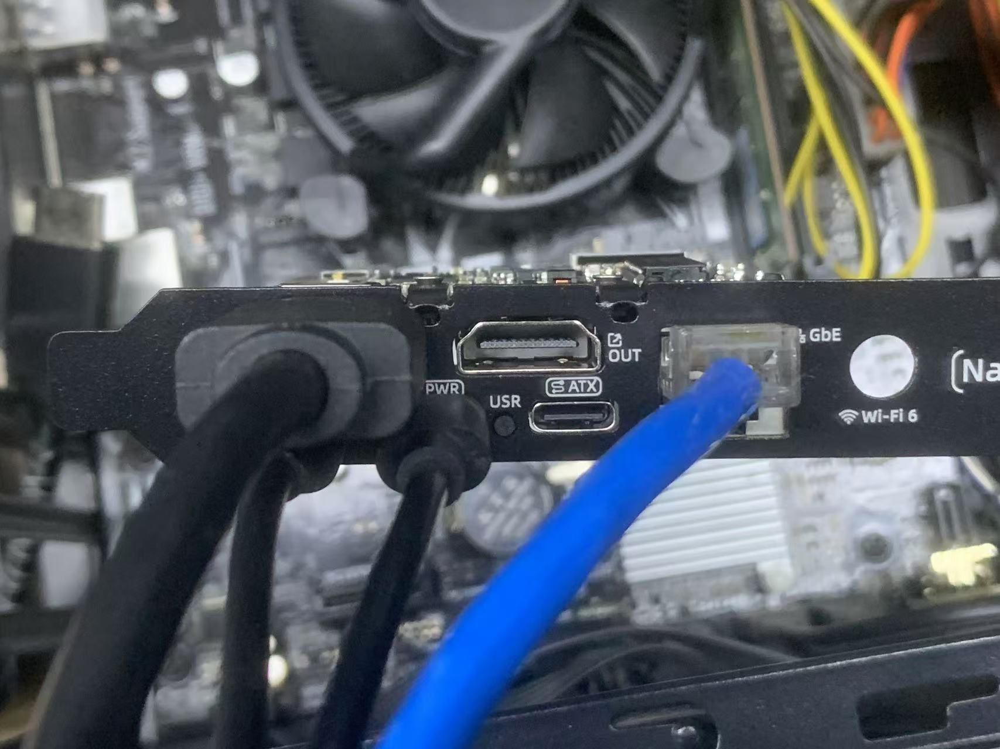
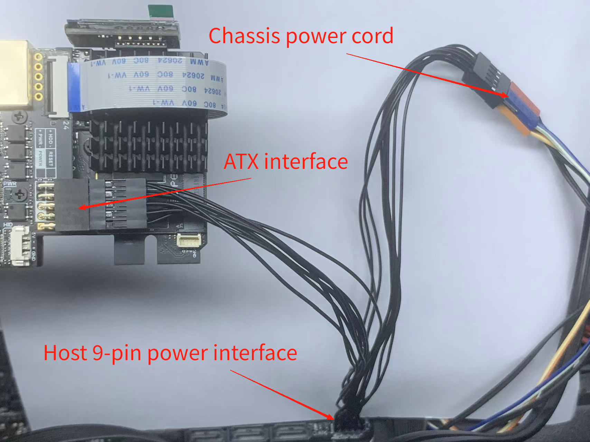

## Unboxing

### NanoKVM-ATX Unboxing List

The NanoKVM-ATX includes:
+ NanoKVM-ATX host with full-height PCIe bracket + OLED *1;
+ HDMI cable 150cm *1;
+ HDMI cable 50cm *1;
+ USB Type A to Type C 100cm *2;
+ 4Pin internal USB cable 40cm *1;
+ ATX-9Pin split power switch cable 30+30cm *1;
+ Small Phillips screwdriver *1;
+ Antenna *1 (WiFi version only);

## Interface Definition

## Wiring

1. Connect the power. The NanoKVM-Pro has slightly higher power requirements, and some motherboard USB ports may not provide sufficient current. To ensure the proper operation of the NanoKVM-Pro, it is strongly recommended to use an external power supply of 5V 1A or higher (actual power consumption is about 3W).

2. Connect the USB-HID interface:
    + ATX version: can use either internal case wiring or external USB-C connection.

> ❗❗❗For the first batch of users (the cable is different from Figure B below), if you choose the internal chassis wiring method, please check your email and follow the modification instructions provided in the email to connect the cables. Alternatively, refer to [here](https://wiki.sipeed.com/nanokvmpro-usb) to modify the cable.

3. Use an Ethernet cable to connect the router/switch to the NanoKVM-Pro. If there is no wired network, this step can be skipped; Wi-Fi can be configured after powering on (requires purchasing the WiFi version).

4. Connect HDMI-IN. If the motherboard has only one video port and an external display is needed, connect HDMI-OUT to your display.

> Note that NanoKVM-Pro supports a maximum capture of 4K30FPS. The built-in HDMI splitter actively reads the resolution and frame rate of the external display and provides a common mode list to the host.
>   If you connect a 4K60FPS display, the computer will recognize it as a maximum supported 4K30 display (limited by the capture device; you can turn off capture to allow 4K60 direct output to the monitor).
>   If you connect a 1080P display, the computer will recognize it as a maximum 1080P display (limited by the loop-out display).
5. (Optional) Connect the ATX power control interface.

## Internal Network Access

### Connecting to the Network

1. If using a wired connection, after powering on, the KVM will obtain an IP address assigned by the router's DHCP, and this step can be skipped.
2. Wi-Fi Connection
    + The ATX version can configure the network via OLED. The steps are as follows:
        1. Connect to the NanoKVM-ATX's AP: Long press the USR button, and the KVM will release a Wi-Fi signal (AP). The OLED will display this IP information, allowing you to scan the QR code for quick connection.
        2. Log in to the webpage to enter the Wi-Fi account and password: After connecting to Wi-Fi, the OLED will display the webpage link. You can manually enter the URL or scan the QR code for quick access to the webpage for configuration.
3. If needed, you can also connect via USB-NCM.

### Accessing the Page

1. For the ATX version: After connecting to the network, the OLED will display the local IP address (E IP is the IP obtained from the wired network; W IP is the IP obtained from the Wi-Fi network, automatically switching display by default).
2. Use a computer on the same internal network to input the IP address in a browser (Chrome is recommended) to access the page.

> It is normal to see this warning. NanoKVM-Pro has enabled HTTPS for enhanced security and uses a self-signed SSL certificate.
3. The default initial account is `admin`, and the password is `admin`. It is strongly recommended to change the account password immediately.
4. Check if the image, keyboard/mouse, and power buttons are functioning correctly.

## Remote Connection

1. NanoKVM-Pro comes pre-installed with the Tailscale application, allowing you to log in with your Tailscale account in the web settings. All devices logged into Tailscale will automatically join the same virtual internal network environment, assigning each device a `100.xxx.xxx.xxx` IP, which can be used to remotely access and control your host.
2. Other remote networking tools: NanoKVM-Pro is based on Ubuntu and can install applications via `apt`, such as ZeroTier. Please follow the official instructions to install related applications.