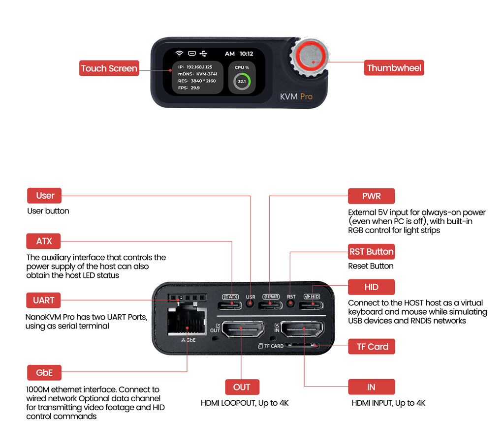
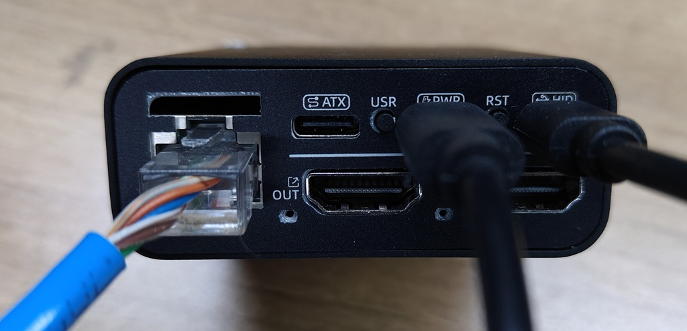
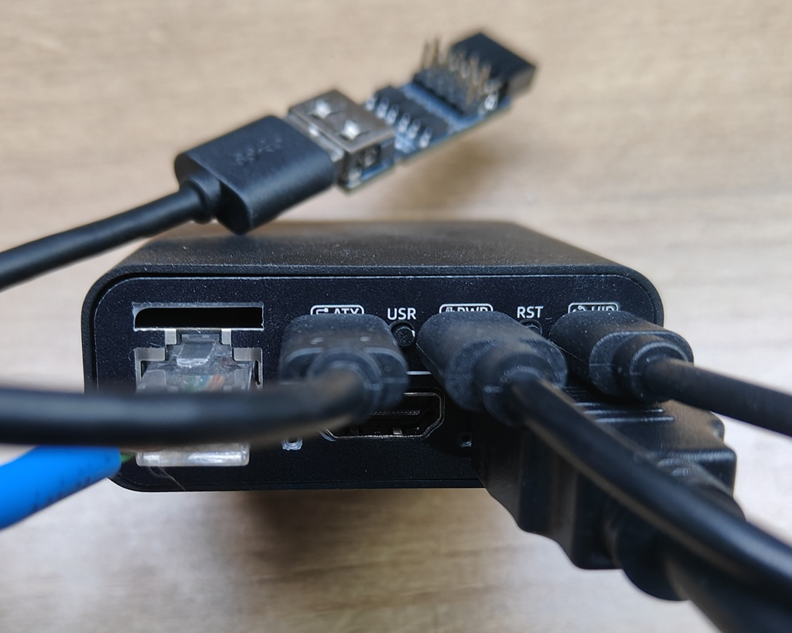
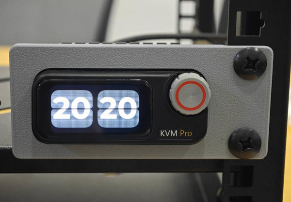

## Interface Definition

## Wiring

1. Connect Power

> NanoKVM-Pro requires a relatively stable power supply. Some motherboard USB ports may not provide sufficient current.
> To ensure stable operation, we strongly recommend using an external 5V 1A or higher power adapter (actual power consumption is around 3W).
> If you plan to use it with an LED strip, we strongly recommend using an external 5V 3A or higher power adapter.

2. Connect the USB-HID interface:

   

3. Use an Ethernet cable to connect the router/switch and NanoKVM-Pro. If no wired network is available, you may skip this step and configure Wi-Fi after startup (Wi-Fi version required; see the Wi-Fi configuration section).

   

4. Connect HDMI-IN. If your motherboard has only one video output and you also need an external monitor, connect HDMI-OUT to your display.

   

   > Note: NanoKVM-Pro supports up to 4K30FPS capture. The built-in HDMI splitter actively reads the external display's resolution and refresh rate, then provides a common mode list to the host.
   > If you connect a 4K60 display, the computer will recognize it as a maximum 4K30 display (limited by the capture module). You may disable capture to allow full 4K60 output to the monitor.
   > If you connect a 1080P display, the computer will recognize it as a maximum 1080P display (limited by the passthrough monitor).

5. (Optional) Connect ATX power control interface

   

   Use a USB-C to A data cable to connect the KVM-B board with the NanoKVM-Desk ATX interface.

   The KVM-B board includes a general 9-pin header, which can be directly attached to the motherboard. The case’s power button, Power LED, and other connectors can be plugged into the KVM-B header. Reference diagram (only power button connected here):

   

## UI Operation Guide

### Appearance

The Desk version features two interactive components on the front:

* 1.47-inch IPS capacitive touch TFT display
* Rotary encoder with button

### Rotary Encoder Operations

The rotary encoder supports the following actions:

* **Rotate Left**: Move focus to the left interactive/focusable component
* **Rotate Right**: Move focus to the right interactive/focusable component
* **Short Press**: Trigger the action of the focused component
* **Long Press**: If on the main page, enter switching mode and display page options

### Touch Operations

Touch screen supports the following actions:

* **Swipe Left**: Move the overall view to the left
* **Swipe Right**: Move the overall view to the right
* **Short Tap**: Trigger the action of the tapped component
* **Long Press**: If on the main page, enter switching mode and display page options

## LAN Access

### Network Connection

1. **Wired Connection**: After powering on, KVM will automatically obtain an IP address from the router via DHCP. No extra configuration is required.

2. **Wi-Fi Connection**:

   1. Open `Settings` → `Wi-Fi`

   2. Short press the `Wi-Fi` switch

   3. If Wi-Fi has not been configured, KVM will start a Wi-Fi hotspot (AP) and display AP information on the screen

   4. Use a phone or computer to connect to the AP with the displayed password, or scan the QR code for quick connection

   5. Once successfully connected, the UI will automatically jump and display a web link

   6. Open the link in a browser or scan the QR code to enter the Wi-Fi configuration page

   > **Note**:
   > You can switch between the AP info page and the web link page by swiping left/right.
   > Once Wi-Fi is successfully connected and the Wi-Fi function is not disabled, the device will automatically connect on each startup.

3. **USB-NCM Connection**: If needed, you can establish a network connection via USB-NCM.

### Network Access

1. After successful connection, the home page will display the device’s IP address. Priority is Ethernet (ETH) first, then Wi-Fi. For detailed IP info, go to `Settings` under the corresponding network card.

2. In the same LAN, use a browser on the host (Chrome recommended) and enter the device IP address to access the page.

   

   > **Tip**: A security warning on the first visit is normal. NanoKVM-Pro enables HTTPS by default with a self-signed SSL certificate for enhanced security.

3. Use the default account `admin` and password `admin` to log in. **We strongly recommend changing the account and password immediately after your first login.**

4. Once logged in, check whether image display, keyboard/mouse control, and power buttons function properly.

   

## Remote Connection

1. **Tailscale**: NanoKVM-Pro comes with Tailscale preinstalled. You can log in to your Tailscale account via the web settings. All devices logged into Tailscale will automatically join the same virtual LAN and be assigned an IP starting with `100.xxx.xxx.xxx`. You can use this IP to remotely access and control your host.
2. **Other Remote Networking Tools**: NanoKVM-Pro runs on Ubuntu and supports installing third-party applications (e.g., ZeroTier) via `apt`. Please follow the official documentation of the respective tool for installation and configuration.

## Rack Mounting
The NanoKVM-Pro Desk is designed with the possibility of rack mounting, though this requires some hands-on modification by the user.

There are four screws located under the rubber feet on the bottom of the Desk unit. The two rear screws can be used for structural mounting. (Note: The two front screws are shorter and are located close to internal PCBA components, so they are not recommended for mounting.)

We provide the 3D model of the Desk unit and a reference design for the rack adapter plate (single-unit and triple-unit)
You may download and 3D print these, or design your own.
[3d_zh](https://makerworld.com.cn/zh/models/1659366-nanokvm-pro-desk-mo-xing#profileId-1821374)
[3d_en](https://makerworld.com/zh/models/1873387-nanokvm-pro-desk-model#profileId-2005371)

Installation Steps
1. Peel off the rear rubber feet and remove the original M2x6 mm screws. (new batch after Oct 2025 is M2x7mm already)
2. Replace them with M2x7 mm screws and fasten the unit to the adapter plate.
3. Secure the adapter plate to the screw holes on the rack rail edge.

Diagrams of the installed unit:

## Heat Dissipation and Working Temperature
For long-term operational longevity, the NanoKVM-Pro Desk utilizes passive cooling.

The KVM's main body uses an aluminum alloy casing. The primary heat dissipation path is from the bottom of the PCBA, transferring heat through thermal paste to the bottom of the enclosure, and then dissipating heat through the bottom surface or radiating from the top surface.

Therefore, placing the KVM on a highly conductive metal surface (such as a metal case or a rack) or in a well-ventilated environment will significantly aid in cooling.

Temperature Specifications
The KVM's typical working power consumption is 3–4W. The operating temperature rise of the chassis surface is about 15–20°C, and the CPU's temperature rise is around 50°C.

For touch scenarios (e.g., desktop use): We recommend an ambient working temperature of under 25°C. This keeps the chassis surface temperature below 45°C. (Note: Since the enclosure is metal, it will feel hotter to the touch than plastic at the same temperature.)

For non-touch scenarios (e.g., rack mounting): We recommend an ambient working temperature of under 40°C.

The figure below shows the surface temperature at an ambient temperature of 26°C
