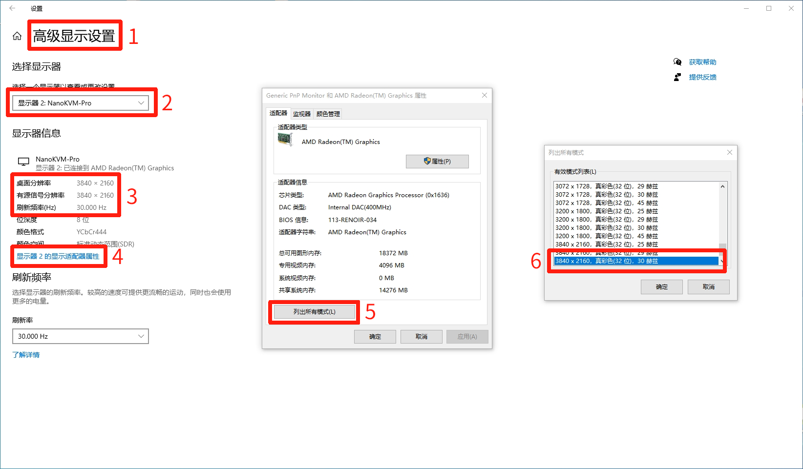
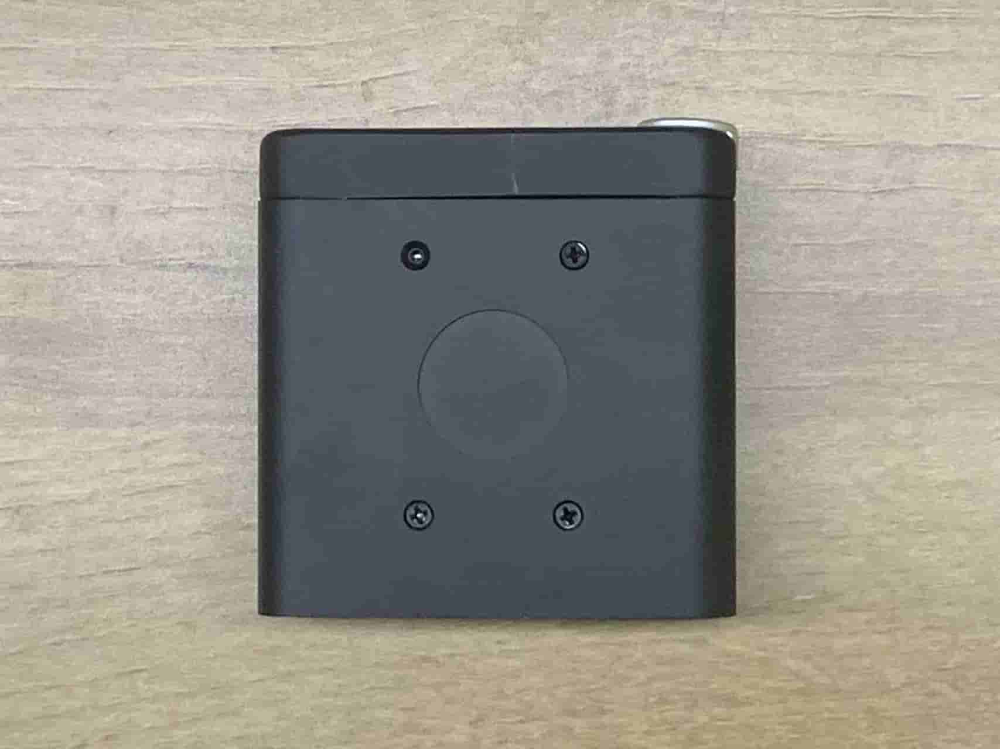

# F&Q

## Updating to Solve Issues

NanoKVM Pro will periodically update applications, and some issues may have been resolved in newer versions. Therefore, please try updating the application first.

## System Boot

### Green LED Blinking

The green LED serves as the power indicator for NanoKVM Pro. If a power source with insufficient capacity is connected, the green LED may blink due to voltage instability and fail to start up. Please disconnect all power connections and replace the power adapter.

## Video-Related Issues

### HDMI Icon Lit on NanoKVM Screen but No Video Displayed in Web Interface

NanoKVM-Pro supports video capture and loop-out functions. When only capturing video, it reports a maximum resolution of 4K30FPS to the host by default. When a loop-out display is connected, it reports a common resolution list.  
For the default resolution and frame rate list, please refer to [here](https://wiki.sipeed.com/hardware/en/kvm/NanoKVM_Pro/extended.html#How-to-Modify-EDID).

When connected through video adapters or docking stations, the reported capabilities may change (e.g., reporting 4K60FPS capture support, which may cause capture failure). In such cases, adjust the display settings in the host system:

- On Windows: Go to `Settings` → `Display` → `Advanced Display Settings` → Select `NanoKVM-Pro` display → `Display Adapter Properties` → `List All Modes` → Choose the desired mode → Click Apply or OK.



### Blurry Image, Not Matching the Captured Resolution

- In the image above, box ③: If the desktop resolution is lower than the active signal resolution, the captured image may appear blurrier than expected. Follow the steps above to output a clear image.

## Image Burning Methods

### USB Burning

NanoKVM Pro supports restoring or updating the system via USB image burning.

#### Preparation

- Prepare a USB data cable
- Download the latest NanoKVM Pro image file
- Prepare a burning tool (such as balenaEtcher, Rufus, or the dd command)

#### Burning Steps

1. **Download the Image and Burning Tool**
   - Visit the [NanoKVM Pro Release Page](https://github.com/sipeed/NanoKVM-Pro/releases/latest) to download the latest image file.
   - Download and install the burning tool [balenaEtcher](https://etcher.balena.io/).

2. **Enter Burning Mode**
   - Use the USB data cable to connect the NanoKVM Pro's HID interface to your computer.
   - Press and hold the User button on the NanoKVM, then power it on (or press the Reset button while powered on) until the orange LED turns off.
   - The device will then enter burning mode, and the orange LED will start flashing again. Check if your computer recognizes the new disk device.

<div style="display: flex; justify-content: center; gap: 20px; flex-wrap: wrap; align-items: flex-end;">
    <div style="text-align: center; flex: 1; max-width: 400px; min-width: 300px;">
        
        <p style="margin-top: 8px; margin-bottom: 0; font-style: italic; color: #666; font-size: 16px;">Windows Recognizing Device</p>
    </div>
    <div style="text-align: center; flex: 1; max-width: 400px; min-width: 300px;">
        
        <p style="margin-top: 8px; margin-bottom: 0; font-style: italic; color: #666; font-size: 16px;">Linux Recognizing Device</p>
    </div>
</div>

3. **Burn Using balenaEtcher (Recommended)**
   - Launch balenaEtcher.
   - Click "Flash from file" and select the downloaded image file.
   - Click "Select target" and choose the recognized NanoKVM Pro device.
   - Click "Flash!" to start the burning process.
   - Wait for the burning to complete and verify.

<div align="center">
    
</div>

- If prompted that the partition table cannot be found, it is normal; click continue.

<div align="center">
    
</div>

4. **Burn Using Command Line**
```bash
# Find the device name
sudo fdisk -l

# Decompress the image file (if it is in .xz format)
xz -dv 20250828_NanoKVMPro_1_0_10.img.xz

# Burn the image (replace /dev/sdX with the actual device name)
sudo dd if=20250828_NanoKVMPro_1_0_10.img of=/dev/sdX bs=4M status=progress

sudo sync
```

5. **Restart the Device**
   - After burning is complete, safely eject the device.
   - Disconnect the USB connection.
   - Reconnect the power, and the device will automatically start the new system.

#### Notes

- Ensure you select the correct device to avoid accidentally operating on other storage devices.
- Do not disconnect the power or remove USB connections during the burning process.
- The first startup may take a long time for initialization and configuration.
- If the orange light does not turn on or the disk device does not appear, please refer to the methods below to use AXDL for burning.

### AXDL Burning

AXDL is an official burning tool provided by Aixin, designed for burning AXP format system images. It currently supports Windows platform only.

#### Preparation

- Prepare a USB data cable.
- Visit the [NanoKVM Pro Release Page](https://github.com/sipeed/NanoKVM-Pro/releases) to download the latest AXP format image file.
- Download and install the AXDL tool and corresponding drivers [Download Link](https://dl.sipeed.com/shareURL/MaixIV/M4N-Dock/10_PC_Software).

#### Burning Steps

1. **Connect the Device**
   - Use the USB data cable to connect the NanoKVM Pro's HID interface to your computer.

2. **Configure the Burning Tool**
   - Open the AXDL tool.
   - Select the downloaded AXP format image file.
   - Click the start burning button.

   <div align="center">
       
   </div>

3. **Enter Burning Mode and Start Burning**
   - Press and hold the User button on the NanoKVM, then power it on (or press the Reset button while powered on).
   - The burning process will start automatically, wait for the progress bar to complete.
   - Wait until the prompt indicates that burning was successful; the entire process is complete.

## Desk Version LCD Not Lighting Up

This may be caused by a loose FPC cable connection of the LCD during transportation.  
Click [here](https://wiki.sipeed.com/nanokvmpro-lcd) to view the issue and repair details.

## Appearance Issues

### "Missing" Bottom Screw

In the first batch of NanoKVM-Desk units, the screw in the top-left position (shown below) was found to affect WiFi connection stability due to structural design considerations. This screw hole is intentionally left empty in later assemblies.

