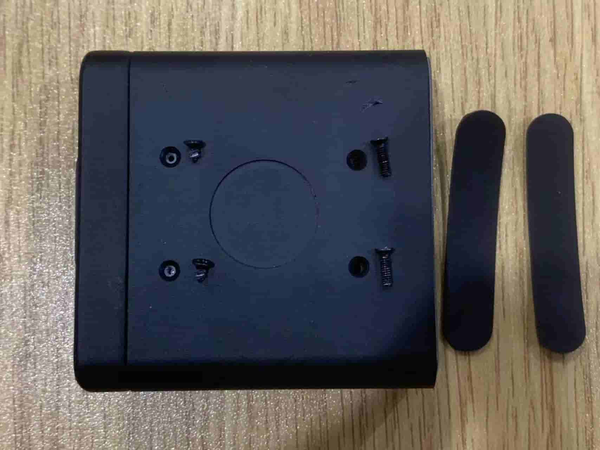
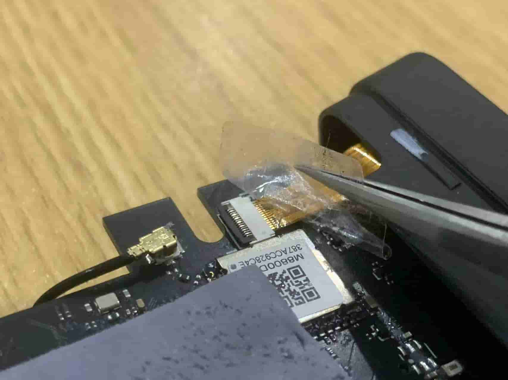
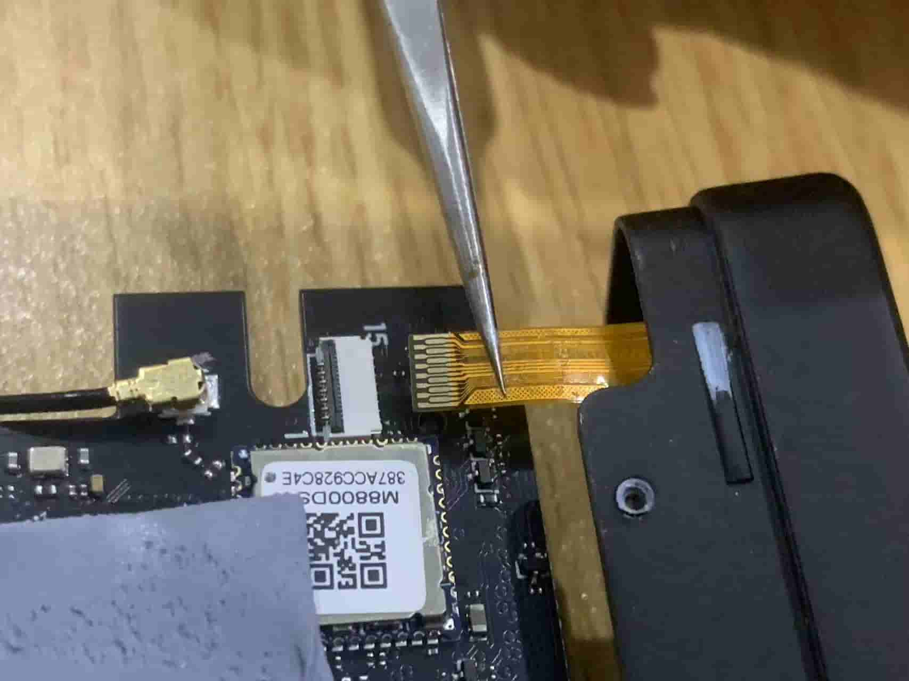
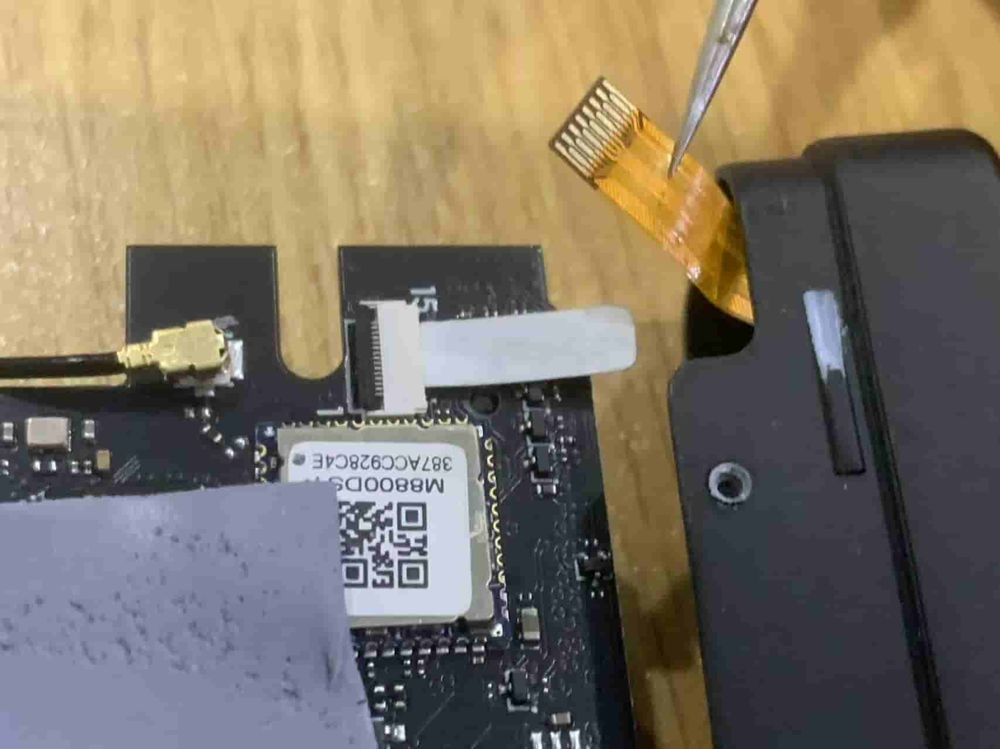
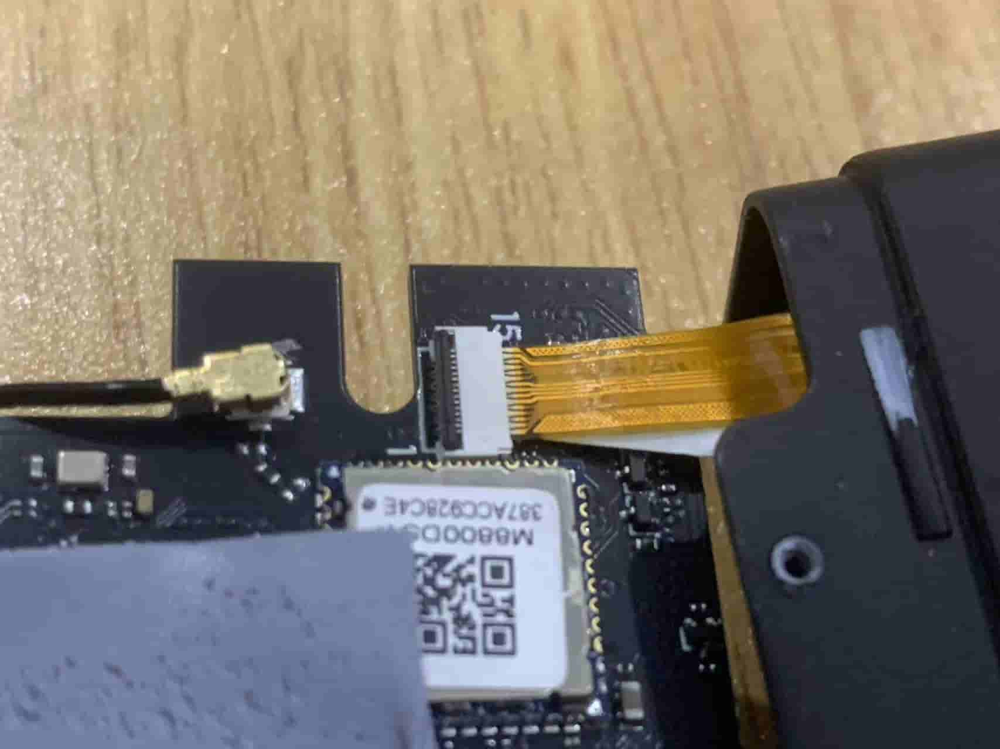

## Applicable Scenarios

1. Screen fails to display properly: No logo appears on startup, but the orange LED on the back blinks normally.
2. Touchscreen malfunctions: No response regardless of tapping, long pressing, or swiping.

## Cause of Issue

The NanoKVM Desk may experience display anomalies due to the FPC flex cable of the screen becoming dislodged or having poor contact as a result of transportation jolts.

## Repair Steps

> ❗❗❗The following steps involve disassembly, which carries risks. Please read the steps carefully before proceeding with caution❗❗❗

**Materials Required**

1. NanoKVM Desk with screen malfunction
2. Screwdriver
3. Thin shim (a piece of paper can be used as an alternative)
4. Tweezers

**Detailed Steps**

1. Peel off the two silicone pads at the bottom (applying a slight diagonal pull can prevent adhesive residue); unscrew the four screws. Note that the screws near the screen side are two short self-tapping screws, while the ones near the rear interface are two long M2 screws. Keep the pads and screws safe.

2. The screen bracket is secured to the anodized aluminum casing by four clips at the bottom and top. Start by prying open the screen cover from the bottom, then from the top.

> ❗❗❗This step is high-risk and may cause the screen flex cable at the bottom to break. Please control the force applied❗❗❗

3. Push the NanoKVM Desk chassis out from behind the rear panel.

4. Use tweezers to remove the sticker on the screen FPC flex cable; lift the black locking clip on the FPC seat and remove the screen flex cable.

5. Insert a thin paper strip into the FPC seat; place the screen FPC flex cable into the paper strip, push it all the way in, and then secure the seat.

> Note: The screen flex cable connects to the seat with the contacts facing up.

6. Power on for testing; the logo should light up on startup.
7. Reassemble the casing, ensuring that the screen bracket is first secured at the top clip and then at the bottom.

8. Screw everything back together, using the shorter screws near the screen side and the longer screws near the interface side; finally, reattach the foot pads.