# SLogic16U3 — Software User Guide

This guide explains how to use the SLogic16U3 with a capture application. It covers connecting and detecting the device, the user interface across platforms, basic and advanced sampling setup, the capture workflow, browsing and measurement tools, protocol decoding, and file operations.

## Connect the SLogic
Best practice: connect the SLogic16U3 to a USB 3.0 port on the host before launching the capture application so the software can auto-detect the device.

If the application is already running:
- Plug the SLogic into a USB 3.0 host port (avoid unpowered hubs).
- Open the application menu and select "Connect to Device" dialog.
- Select the SLogic driver/back-end.
- Click "Scan".
- Choose the SLogic device from the discovered list and click "OK".

Troubleshooting checklist:
- Try a different USB cable or a different host port.
- Confirm device power/LED indicators are on.
- Unplug and replug the device, then reopen the Connect dialog or relaunch the app.
- On Linux, check permissions (use sudo for quick testing or install udev rules; see FAQ).
- See: [Why can't I find the SLogic16U3 device?](./FAQ.html#why-cant-i-find-the-slogic16u3-device)

## User Interface

### Windows
- Menus, dialogs, and file dialogs follow Windows conventions.

### Linux
- Layout is similar to other platforms.
- Note: regular Linux users may lack permissions to access USB devices. For quick tests run the app with sudo; for day-to-day use install udev rules (see FAQ).
- Running an `AppImage -l5` from a terminal can show helpful logs when troubleshooting.

### macOS
- Menus are on the system menu bar; dialogs integrate with macOS UI conventions.
- If macOS blocks access, open System Preferences → Security & Privacy and grant permission for the app.
- Prefer direct ports or a powered USB3 hub.

## Basic sampling modes and configuration
Before capturing, configure these core settings:

- Channel enables: enable only the channels you need to reduce bandwidth and increase sample-rate headroom.
- Voltage threshold: set according to the device under test (DUT) logic levels.
- Sample rate: pick a preset; allowed rates depend on active channels and USB bandwidth.
- Sample depth / capture length: choose number of samples.

### Configuration (mixed settings)
Recommended quick workflow:
1. Enable required channels (16/8/4 as needed).
2. Set voltage thresholds where supported.
3. Select a sample-rate preset compatible with enabled channels.
4. Choose sample depth.
5. Configure your trigger or just start acquisition.

Tips:
- Enabling less channels increases achievable sample rates.
- For long captures, validate disk space before saving/exporting.

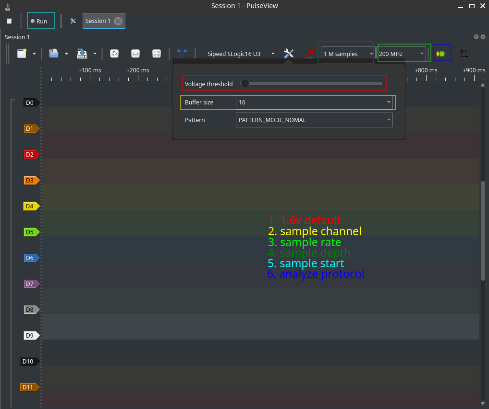

### Voltage threshold
- Choose thresholds matching the DUT:
  - ~1.6 V for many low-voltage systems (e.g., 3.3 V or 5 V logic).
  - Up to 6.0 V for higher-voltage signals—verify hardware limits first.
- When unsure, measure the signal with a multimeter or oscilloscope before connecting.

### Channel / sample-rate presets
- Available sample rates shrink as more channels are enabled due to USB throughput limits.
- Use the preset list to switch between standard modes (16ch / 8ch / 4ch).
- If you need finer time resolution, reduce active channels and increase the sample rate.

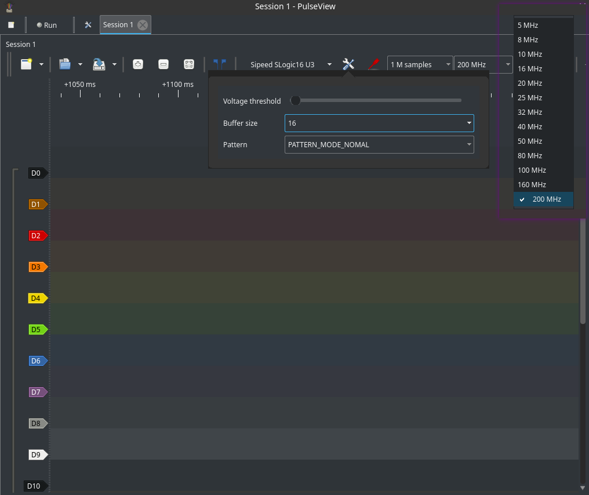

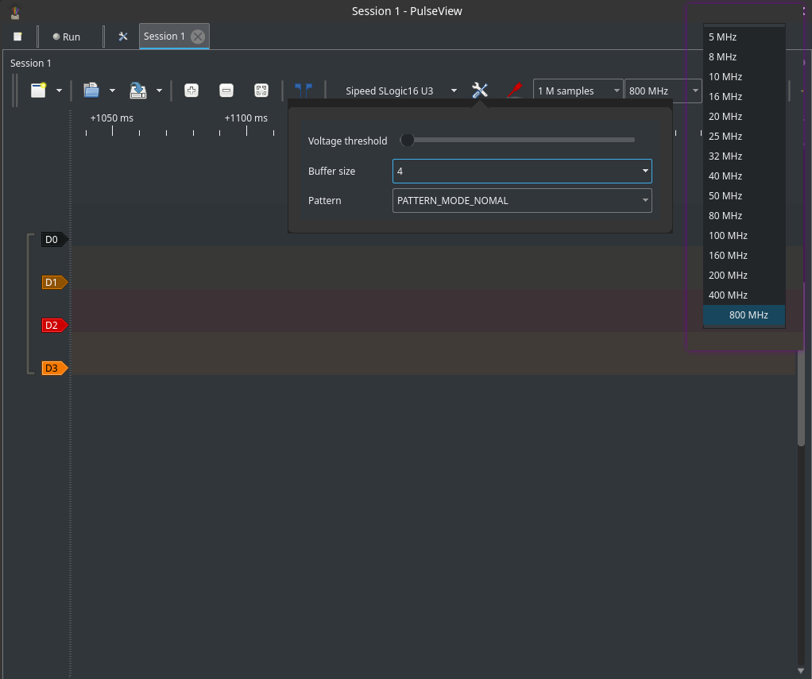

### Sample depth / capture length
- Choose a sample depth (points) or capture time. The product of sample rate × depth determines memory and storage usage.

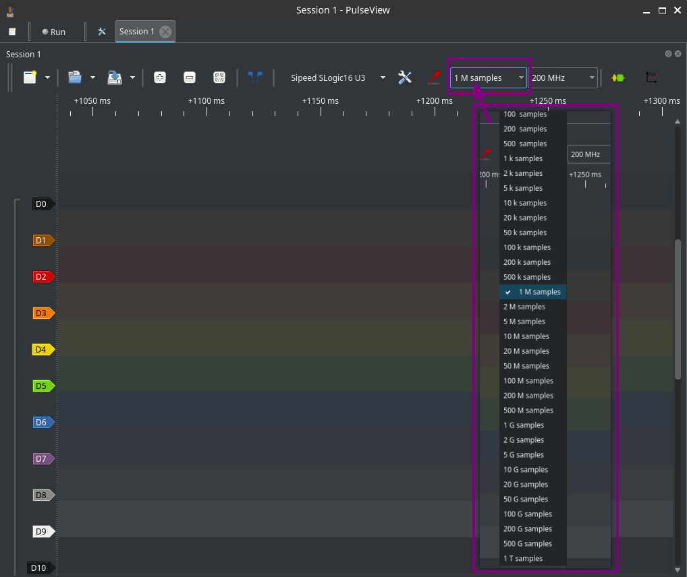

## Advanced: Trigger configuration
Supported trigger types typically include:
- Edge trigger (rising/falling) on a single channel.
- Level trigger (signal above/below threshold for duration).
- Combine triggers across multiple channels.

How to set a basic edge trigger:
1. Open Trigger settings.
2. Choose the channel and select Rising or Falling or anything else.
3. Add additional channel conditions for compound triggers if needed.

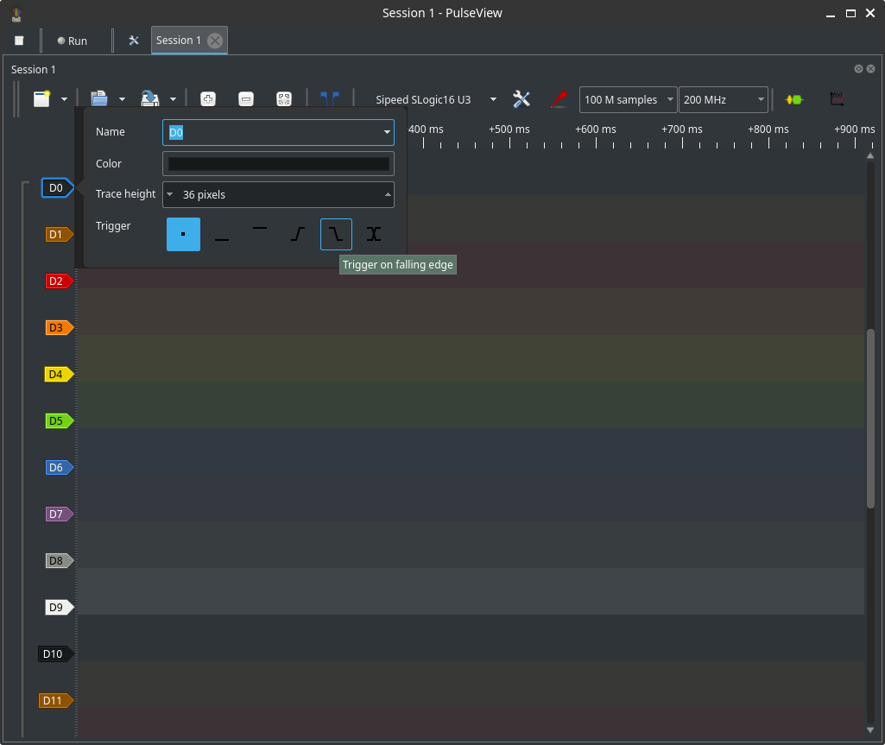

## Capture workflow

### Typical steps
1. Connect the device and confirm detection.
2. Configure channels, voltage thresholds, and sample rate.
3. Set sample depth and trigger mode.
4. Start capture and wait it to be finished.
5. Inspect waveforms and use decoders or measurements.

Capture modes:
- Continuous/stream: capture continuously until stopped; manage data size and memory.

If you encounter dropped samples:
- Lower the sample rate or reduce enabled channels.
- Use a dedicated USB 3.0 port and a high-quality USB cable.

### With trigger
- Configure trigger conditions before starting capture to ensure the event is captured in the buffer.

## Browse and ruler measurements
Navigation and controls:
- Zoom in/out: mouse wheel or Up/Down buttons.
- Pan forward/back: drag or hold Shift + scroll or hold Shift + Up/Down buttons.
- Move vertically across channels: hold Ctrl + scroll or hold Ctrl + Up/Down buttons.

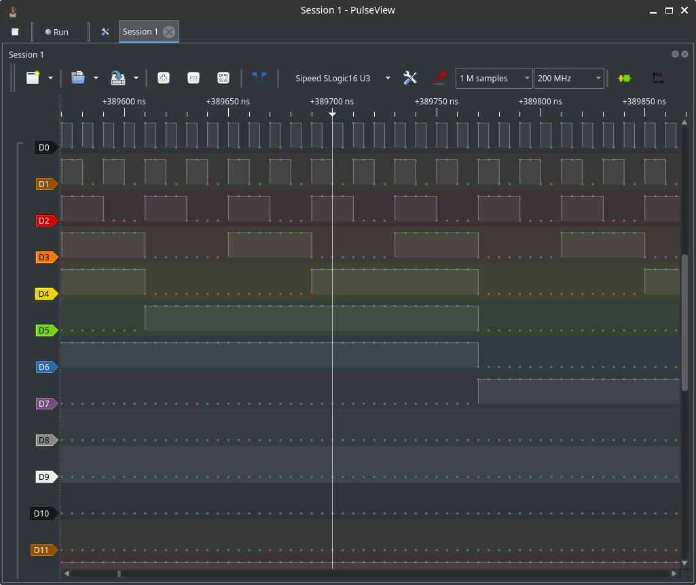

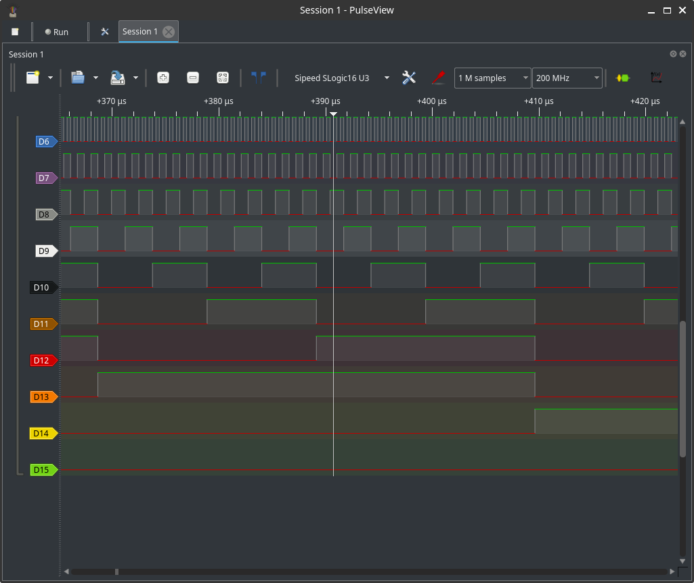

Rulers:
- Add time rulers to measure intervals. Place two rulers to compute the delta time.
- Use ruler measurements to calculate baud rate, pulse width, or event spacing.
- Hold Shift + drag to create the ruler for measurements.
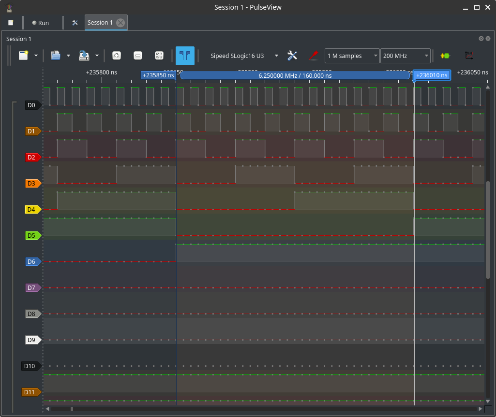

## Protocol decoders
To decode a bus:
1. Open the Decoder pane.
2. Select the protocol (I2C, SPI, UART, CAN, SDIO, etc.).
3. Configure pins, byte order (LSB/MSB), clock polarity/phase and baudrate/clock speed.
4. Enable the decoder; decoded frames are annotated on the waveform and are clickable for details.
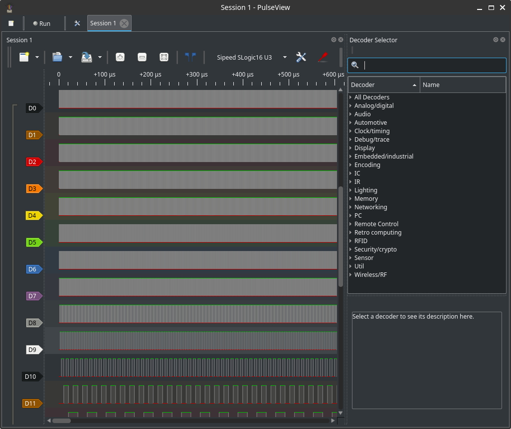

Tips:
- Map probe pins correctly to logical signals (MOSI/MISO/SCLK/CS, TX/RX).
- Increase sample rate for high-speed buses to ensure correct decoding.
- Disable unused decoders to reduce CPU and UI load.

### UART examples (4M)

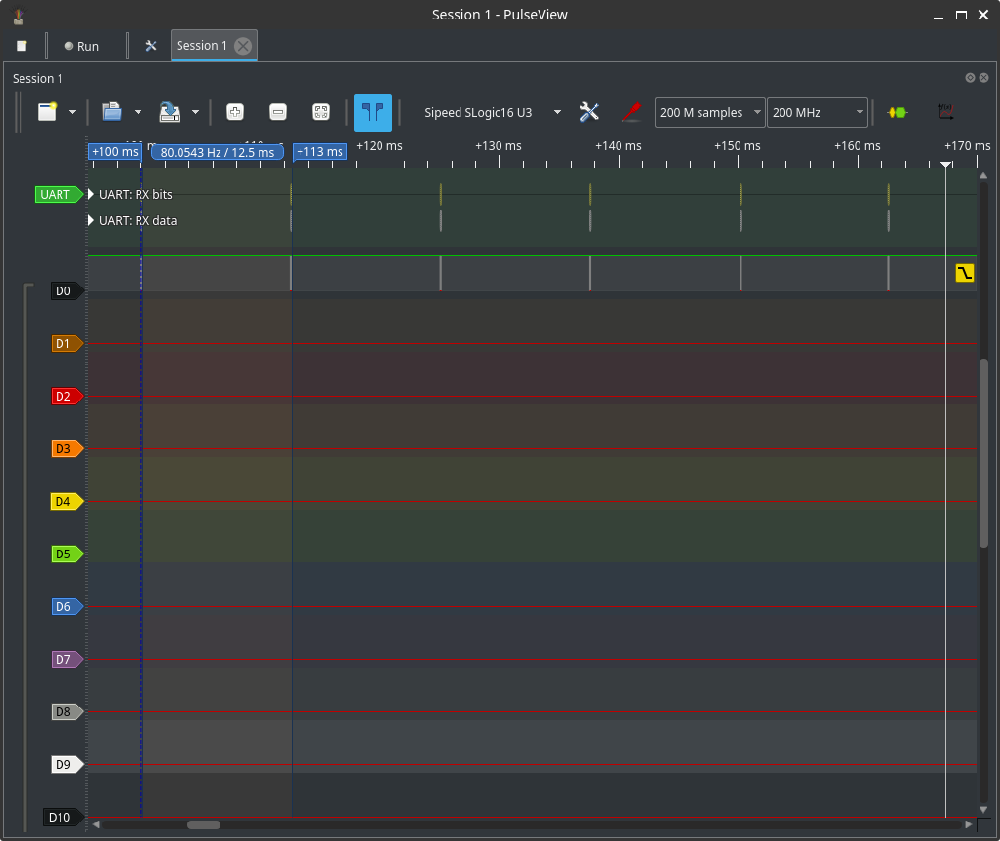

### SDIO / SDCard examples

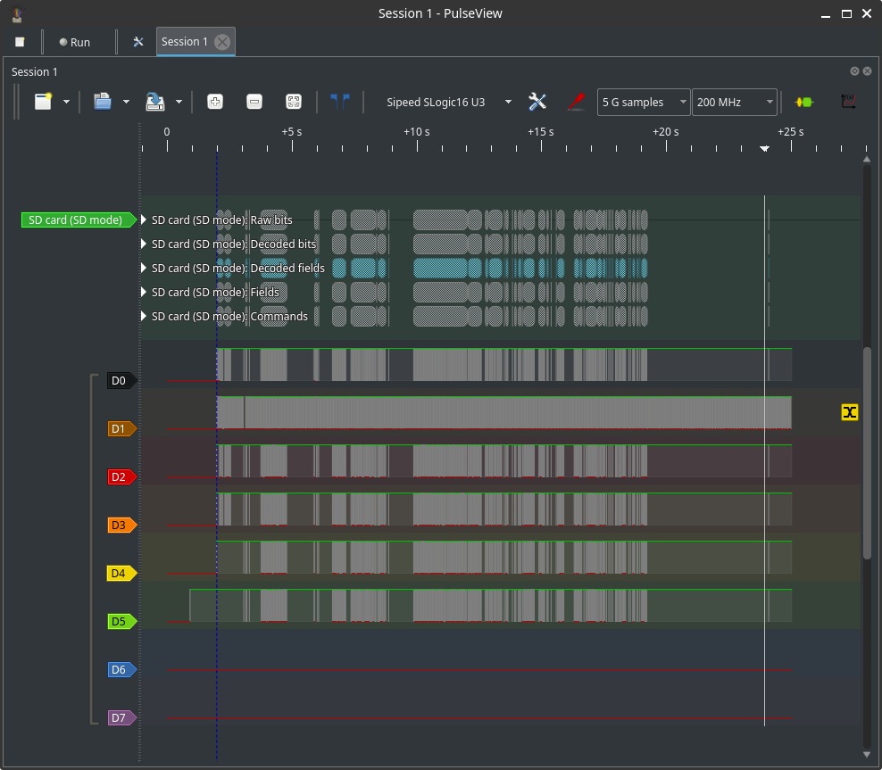

## File operations (save / load)
- Save session: stores captured samples, channel configuration, trigger settings, and decoder state. Use sessions to preserve work for later analysis.
- Load session: restores the saved capture and UI state.

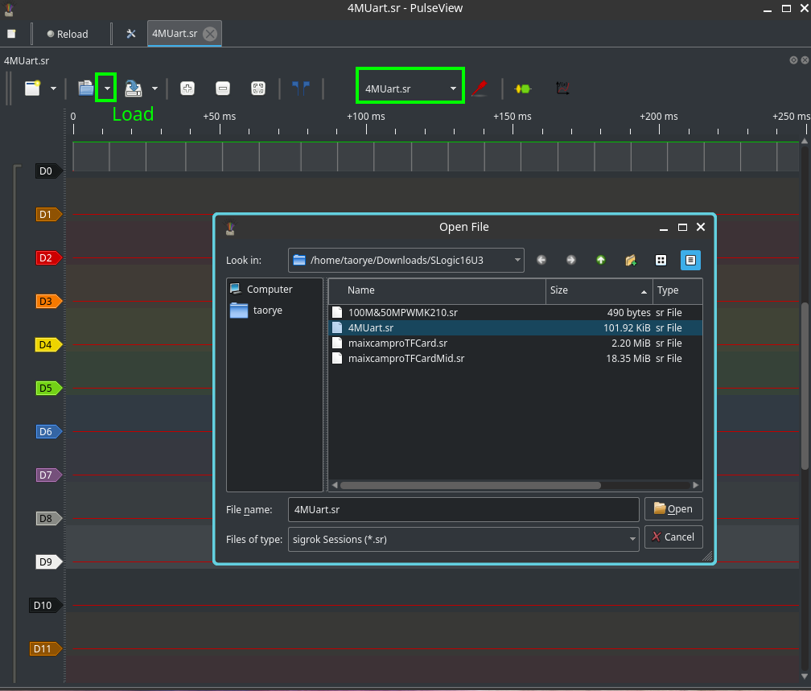

<!-- End of Software User Guide -->
