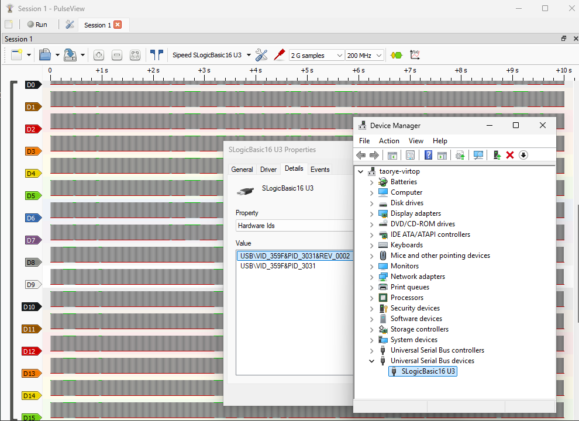
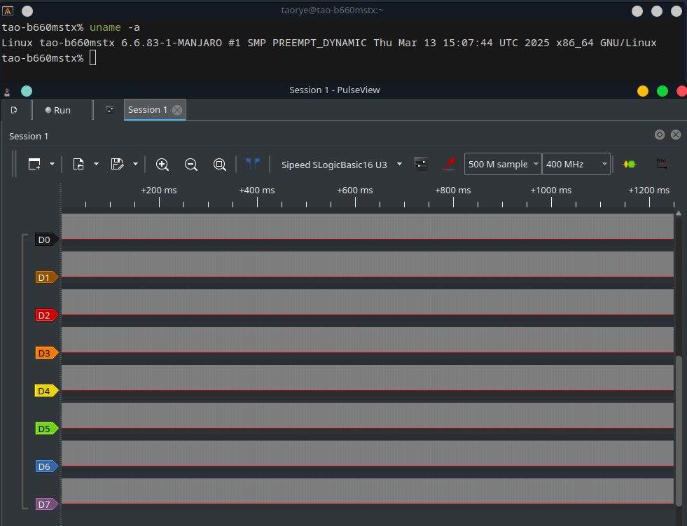
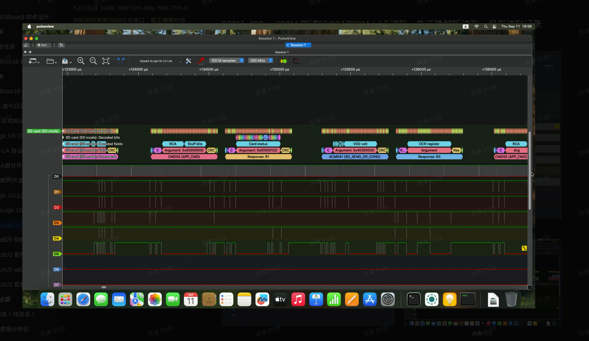
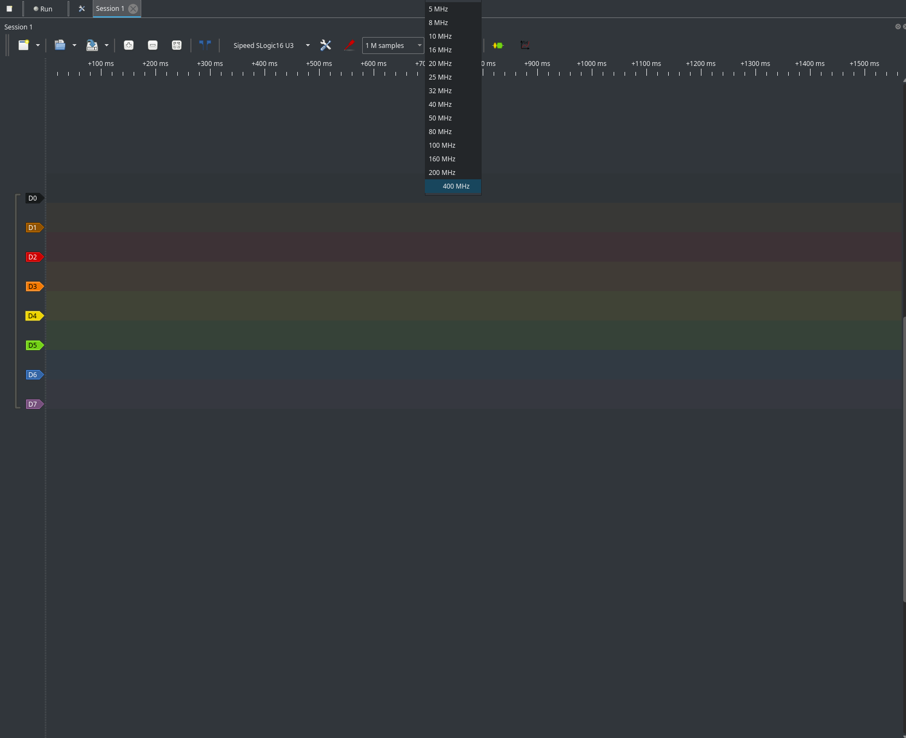
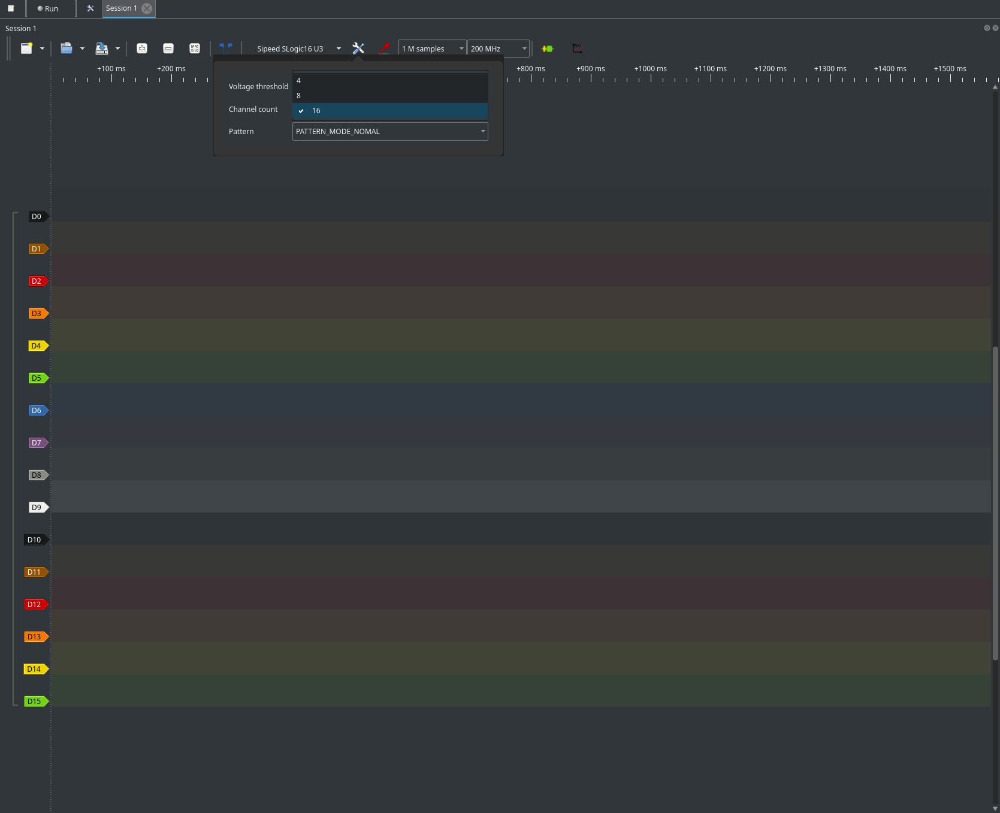
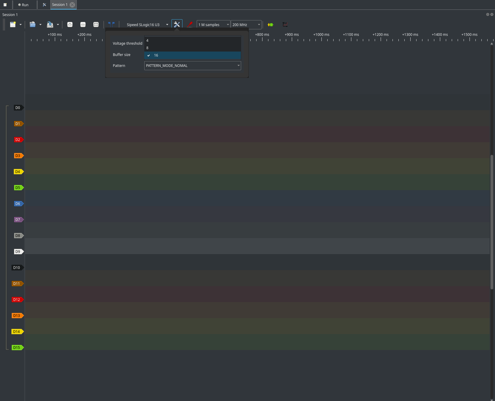
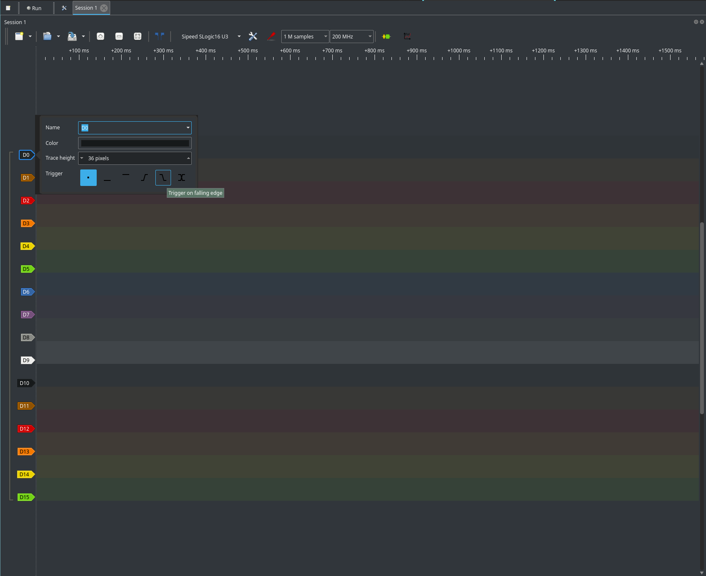
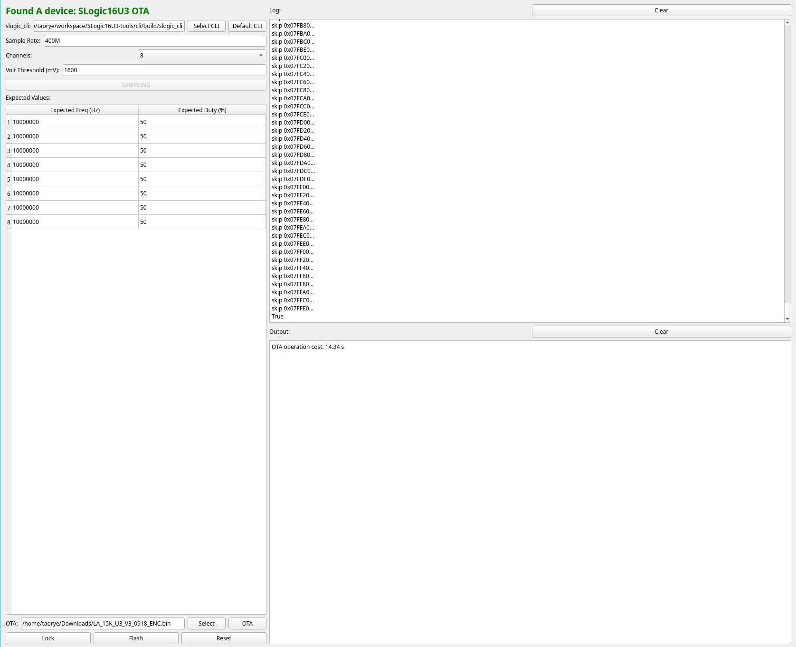

# Slogic16U3 User Guide

👷‍♂️ This guide is under active development — thank you for your patience!

---

## Revision History

| Date       | Version | Author      | Description           |
|------------|---------|-------------|-----------------------|
| 2024-09-23 | v0.1    | Sipeed Team | Initial draft         |

---

## Table of Contents

1. [Overview](#overview)
2. [Specifications](#specifications)
3. [Hardware Connection](#hardware-connection)
4. [Software Installation](#software-installation)
5. [Software Usage](#software-usage)
6. [Build Software from Source](#build-software-from-source)
7. [Firmware Update](#firmware-update)
8. [FAQ](#faq)

---

## Overview

Slogic16U3 is a high-performance logic analyzer for digital signal debugging and analysis.

<div style="display: flex; flex-wrap: wrap; gap: 10px; width: 100%;">
  
  
  
</div>

---

## Specifications

- **Channels:** 16
- **Max Sampling Rate:** 800 MHz
- **Memory Depth:** Unlimited
- **Interface:** USB 3.0 (5 Gbps)
- **Power Supply:** USB powered (5V 900mA)
- **Dimensions:** 150 × 100 × 30 mm

---

## Hardware Connection

- **USB-C to C** or **USB-A to C** cable:
    1. PC USB-A → USB-A/C to USB-C → SLogic
    2. PC USB-C → USB-C to USB-C → SLogic
- **Indicators:** Multi-color (see FAQ)
- **Accessories:** Standard Dupont wires, high-speed shielded wires

---

## Software

### Supported OS and Tested Platforms

| OS / Platform      | Supported | Example Platform           |
|--------------------|-----------|---------------------------|
| Windows (x86_64)   | Yes       | Ultra 5 125H              |
| Linux (x86_64)     | Yes       | 8th Gen Core i5+          |
| Linux (aarch64)    | Yes       | RPI5                      |
| macOS (aarch64)    | Yes       | Apple Silicon M4          |

### Supported Protocols

A wide range of protocols are supported, including:  
AC '97, I²C, SPI, UART, CAN, JTAG, 1-Wire, PWM, USB, and many more.  
*For the latest list, refer to the software's decoder selection panel.*

### Installation

#### Windows

- Extract the portable archive and double-click `pulseview.exe` to launch.



- To enable debug mode, run in terminal:
```cmd
pulseview-debug.exe -l5
```


#### Linux

```bash
chmod +x Pulseview.appimage
./Pulseview.appimage
# ./Pulseview.appimage -l5   # enable debug mode
```




#### macOS

- Download and open `Pulseview.dmg` to install.




**Related Links:**  
Taobao, AliExpress, MaixHub  
Email: support@sipeed.com

---

## Software Usage

- The interface and workflow are similar to DSView.
- Configure channels, sample rate, sample points/time, and other parameters as needed.
- Use the software to trigger, acquire, browse, measure, decode protocols, and manage files.

### Changing the Sample Depth

- The sample depth determines how many data points are captured per acquisition.
- You can set the sample depth in the main control panel, typically as either a number of points.
- Higher sample depth allows capturing longer or more detailed signal traces, but requires more memory and may take longer to transfer.
- If you only need to capture short events, reduce the sample depth for faster operation.
- Adjust the sample depth before starting acquisition to fit your analysis needs.
- **Sample depth is unlimited if you have a large enough disk; data can be streamed directly to storage.**


### Changing the Sample Rate

- **Max sample rate:** 800 MHz (depends on active channels)
    - **16 channels:** up to 200 MHz
    - **8 channels:** up to 400 MHz
    - **4 channels:** up to 800 MHz
- Set the sample rate in the main control panel.
- If higher rates are unavailable, disable unused channels.





### Selecting Active Channels

- Choose between **16**, **8**, or **4** channel configurations.
- Enable/disable channels in the configuration area.
- Fewer active channels allow higher sample rates.





### Adjusting Voltage Threshold

- Set threshold from **0.1V to 6.0V** in **0.1V steps**.
- Adjust in the channel/device configuration panel.
- Match threshold to your logic level (e.g., 1.0V for 3.3V CMOS).
- Apply changes before acquisition.


Tip: For 3.3V CMOS/TTL, set threshold to ~1.0V (30% of 3.3V).

### Edge Trigger

- Configure edge trigger to start capture on a specific signal transition.
- In the trigger panel, select channel and trigger type (rising, falling, or both).




---

## Build Software from Source

The software is open source.

- [Sipeed's libsigrok GitHub Repository](https://github.com/sipeed/libsigrok/tree/slogic-dev)

**Recommended:** Use [sigrok-util](https://github.com/sigrokproject/sigrok-util) build scripts for a simple, cross-platform experience.

**Steps:**
1. Clone sigrok-util and follow its README for dependencies.
2. Edit the build script to use Sipeed's libsigrok fork:
    ```bash
    $GIT_CLONE https://github.com/sipeed/libsigrok -b slogic-dev
    ```
3. (Optional) Add options to speed up build and reduce size:
    ```
    --disable-all-drivers --enable-sipeed-slogic-analyzer --disable-bindings --enable-cxx
    ```
4. Run the build script for your target (e.g., `./sigrok-cross-linux`, `./sigrok-cross-mingw`, `./sigrok-cross-macosx`).

For advanced/manual builds, refer to upstream sigrok and PulseView documentation.

---

## Firmware Update

Firmware updates are provided via a Python/PyQt GUI tool.

- [Firmware update tool repository](https://github.com/sipeed/slogic16u3-tools)

**Update steps:**
1. Clone/download the repository:
    ```bash
    git clone https://github.com/sipeed/slogic16u3-tools.git
    ```
2. Install dependencies and set up the environment:
    ```bash
    source .venv/bin/activate
    ```
3. Navigate to the `pt` directory:
    ```bash
    cd pt
    ```
4. Run the GUI tool:
    ```bash
    python src/gui.py
    ```
5. Press the **mode** button on the device. The GUI should display "SLogic16U3 OTA".
6. Select the firmware file in the GUI.
7. Click **OTA** to start the update.
8. Wait for completion and follow on-screen instructions.

> **Note:** A binary version of the update tool will be released soon.



---

## FAQ

### Why can't I find the SLogic16U3 device in Linux?

Normal users can't access USB devices by default.  
Run Pulseview with `sudo`:

```bash
sudo ./Pulseview.appimage
```

Or set up udev rules (see below).

### How do I set up udev rules for Linux?

Create a new udev rules file:

```bash
sudo tee /etc/udev/rules.d/60-sipeed.rules <<EOF
SUBSYSTEM!="usb|usb_device", GOTO="sipeed_rules_end"
ACTION!="add", GOTO="sipeed_rules_end"
ATTRS{idVendor}=="359f", MODE="0666", GROUP="plug_dev", TAG+="uaccess"
ENV{ID_MM_DEVICE_IGNORE}="1"
LABEL="sipeed_rules_end"
EOF
```

Reload udev rules and trigger:

```bash
sudo udevadm control --reload
sudo udevadm trigger
```

Unplug and reconnect the device.  
You can now run Pulseview as a normal user.

### Why can't I use higher sample rates? Only 200M shows.

The maximum sample rate depends on the number of active channels and USB bandwidth.  
Slogic16U3's USB 3.0 provides up to ~400MB/s.  
To use higher rates (400M/800M), disable unused channels.