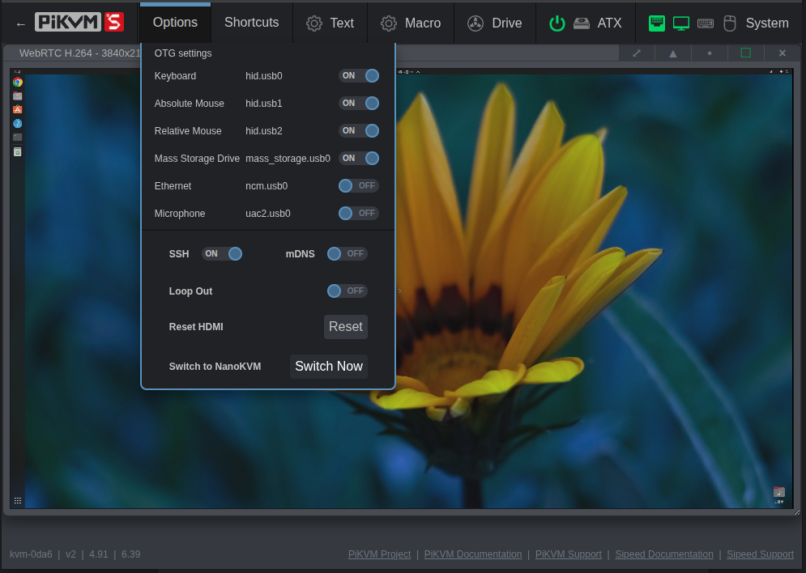
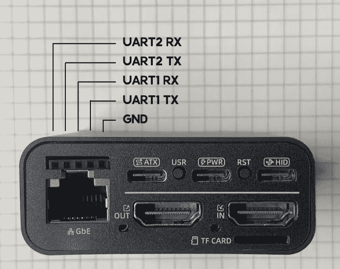

## 切换至PiKVM

NanoKVM Pro除运行 NanoKVM 框架外还适配了PiKVM软件框架。您可以根据需求切换使用

### 切换至PiKVM

NanoKVM Pro 出厂默认使用 NanoKVM 框架，可以在`设置`->`关于`->`切换设备`


点击后系统将自动重启，并启动为PiKVM框架。此过程约30s，如果长时间不自动切换，请手动刷新网页。


PiKVM框架下默认帐号密码也是`admin`，`admin`，但两个平台下使用各自的帐号与密码，并不统一，强烈建议登陆后修改。


> PiKVM框架下部分功能需要借助网页终端实现：如WiFi配网、Tailscale配置
> NanoKVM更新时，PiKVM框架将同步更新

### 切换至NanoKVM

从PiKVM系统切换回NanoKVM同样简单，只需在`Options`->`Switch to NanoKVM`点击`Switch Now`即可



点击后系统将自动重启，并启动为NanoKVM框架。此过程约30s，如果长时间不自动切换，请手动刷新网页

## SSH & mDNS

### SSH

NanoKVM-Pro 出厂默认关闭 SSH，以确保系统安全。若需要启用 SSH 服务或在预览新版本时使用，可以通过以下方式开启：

- **ATX/Desk**：从网页端 `设置` → `设备` → 开启 `SSH`
- **Desk**：从屏幕中点击 `Settings` → `SSH` 开启 `SSH`

默认帐号为 `root`，密码为 `sipeed`。若在 NanoKVM 界面中修改了网页帐号密码，SSH 密码会同步更新。

### mDNS

如需开启或关闭 mDNS，可通过以下方式操作：

- **ATX/Desk**：从网页端 `设置` → `设备` → 开启/关闭 `mDNS`
- **Desk**：从屏幕中点击 `Settings` → `mDNS` 开启/关闭 `mDNS`

## HDMI 输入与环出

> 目前仅支持 Desk 版本屏幕中配置
> ATX/Desk 网页端近期会添加该功能

若暂时无需 HDMI 功能，可关闭以降低功耗。操作方式：

Desk 从屏幕点击 `Settings` → `HDMI` 进入 HDMI 配置页面，有两个选项：

- **INPUT**：关闭后，Desk 停止采集 HDMI 输入信号。
- **LOOP OUT**：关闭后，Desk 停止输出 HDMI 环出信号。

## 屏幕调整

### ATX 版本

目前支持 OLED 屏幕的以下功能：

- 短按 `USR` 按钮可开关 OLED 显示

### Desk 版本

支持 LCD 屏幕的以下功能（均从屏幕中进行配置）：

- 调整背光亮度：`Settings` → `Brightness`
- 待机时钟：`Settings` → `Auto Clock`
  - 关闭时，LCD 常亮
  - 开启后，长时间无操作则切换为时钟显示

## 恢复出厂设置

### 快速恢复

- **ATX**：长按 `USR` 按钮，直至屏幕显示 `Reset` 提示后松开
    > 要求版本 ≥ `1.0.13`
- **Desk**：从屏幕中点击 `Settings` → `Help` 进入 Help 页面，然后连续点击重置按钮，直至显示 `0`，设备进入恢复模式

> **提示**：在设备完成重启并刷新屏幕前，请勿进行其他操作。

### 深度恢复

详见 [FAQ](https://wiki.sipeed.com/hardware/zh/kvm/NanoKVM_Pro/faq.html#%E9%95%9C%E5%83%8F%E7%83%A7%E5%BD%95%E6%96%B9%E6%B3%95) 中 `镜像烧录方法` 章节。


## USB 扩展功能

### USB NCM

NCM 功能可通过 USB 模拟网卡，方便用户直接通过 USB 登录 NanoKVM。开启方式如下：

- **ATX/Desk**：从网页端进入 `设置` → `设备` → 开启 `虚拟网卡`
- **Desk**：从屏幕中点击 `Settings` → `USB` 进入 USB 配置页面，开启 `NCM`

## 更新

NanoKVM Pro 会不定时推送新版本的应用，包含新功能和bug修复，您可以在`设置`->`检查更新`中更新应用版本。


点击下载后会自动下载新应用的安装包，包含`kvmcomm_x.x.x_arm64.deb`、`nanokvmpro_x.x.x_arm64.deb`、`pikvm_x.x.x_arm64.deb`

- `kvmcomm_x.x.x_arm64.deb` 负责驱动 NanoKVM 和 PiKVM 框架中共用的硬件；
- `nanokvmpro_x.x.x_arm64.deb` NanoKVM 应用软件
- `pikvm_x.x.x_arm64.deb` PiKVM 应用软件

打开预览更新功能将会获取到最新的实验版应用，通常包含更新的功能，但稳定性有待验证，建议下载预览更新前先打开SSH功能

您也可以下载特定的版本，并手动安装

```shell
# 以下载 1.1.6 版本为例
# 下载文件
sudo curl -L https://cdn.sipeed.com/nanokvm/preview/nanokvm_pro_1.1.6.tar.gz | sudo tar -xz

# 进入文件夹
cd nanokvm_pro_1.1.6

# 安装deb包
sudo apt install ./*.deb
```

> 1.1.5 及后续软件进行过一次架构调整，较低版本的NanoKVM-Pro只能拉取到 1.1.5 ，更新后可再次拉取到最新的版本

## 如何使用TF卡扩展存储

NanoKVM-Desk 版后面板设计有TF卡槽，插入TF卡后可以扩展存储空间，并带来`虚拟U盘`的功能。

TF卡默认挂载与 NanoKVM 系统 `/sdcard` 目录下，当开启`虚拟U盘`后TF卡被同时挂载到USB复合出的大容量存储设备，可以借此功能向被控主机传递文件

> 注意：
> ATX版本因挡板尺寸要求，无法暴露TF卡槽
> 首批Desk版本TF卡无法热拔插，请在关机状态下插入TF卡
> 虚拟U盘和镜像挂载功能不可同时开启

## 如何设置静态IP

NanoKVM-Pro 在`1.1.6`及以上版本中加入了以太网卡的静态IP设置功能，通过配置`/boot/eth.nodhcp`文件来主动赋予IP，详细设置方法如下：

在 NanoKVM-Pro 中创建文件 `/boot/eth.nodhcp` ，然后按照以下规则进行编辑：

- 一行就是一个自定义 IP，格式为 `addr/netid gw[optional]` ；
- 可以分多行来预设多个静态 IP。

简化的步骤如下：

``` shell
# 以下操作在 NanoKVM-Pro 的网页终端或ssh终端完成
# 创建 /boot/eth.nodhcp 文件并写入配置
echo "192.168.2.2/22" > /boot/eth.nodhcp
```

> 系统启动时，会读取 `/boot/eth.nodhcp` 文件中的静态 IP 地址列表。设置流程如下：
> 1.  **顺序检测**：系统将按行读取文件中的 IP，并依次检测其是否已被网络中的其他设备占用。
> 2.  **检测机制**：优先使用 `arping` 进行检测；若系统中未安装 `arping`，则自动降级使用 `ping` 命令。
> 3.  **设置可用 IP**：一旦发现首个未被占用的 IP，系统立即将其设置为本机静态地址，流程终止。
> 4.  **后备方案**：若列表中所有 IP 均被占用，系统将转而尝试通过 DHCP 自动获取 IP。
> 5.  **保底地址**：如果 DHCP 也无法分配地址（例如，网络中无 DHCP 服务器），系统将使用固定的保底地址 `192.168.90.1`。

## 如何使用串口

NanoKVM Pro 提供两组可用串口 UART1/UART2（ATX版本受限挡板规范尺寸没有引出，仅保留内部焊盘）

Desk 版本接口定义示意图如下：


- 网页端使用串口终端

**需要更新至 1.1.5 版本以上**

网页菜单栏->终端->串口中断 可以设置串口号以及波特率等选项


- 仅发送串口指令

```shell
# 设置ttyS1为115200波特率
stty -F /dev/ttyS1 115200

# 发送十六进制数据 0x11, 0x22, 0x33
echo -n -e '\x11\x22\x33' > /dev/ttyS1
```

## 如何修改EDID

EDID（扩展显示识别数据）是显示设备向主机提供的一组数据，包括设备信息、分辨率帧率列表、颜色特性、音频能力等。主机接受到 EDID 后按需调整显示器的设置

NanoKVM Pro 支持修改虚拟显示屏暴露的EDID，您可以克隆显示器的EDID或编写自己的EDID，来达到特殊的屏幕比例、刷新率或颜色特征

> 修改EDID后可能存在无法正常显示的风险，请谨慎修改。如果出现异常，请恢复默认EDID

写入方式：

```shell
# 1. 准备edid文件，一般大小是256Byte，scp 到系统中
ls -l /root/customize.bin
# -rw-r--r-- 1 1000 1000 256 Aug 19 14:44 /root/customize.bin
# 2. 写入EDID
cat /root/customize.bin > /proc/lt6911_info/edid
# 3. 恢复默认EDID：
cat /kvmcomm/edid/e18.bin > /proc/lt6911_info/edid
```

1.0.15版本中自带两个edid：`e18.bin`和`e48.bin`，`e18.bin`中写入了一组较为保守的参数，大部分系统都能正常识别；`e48.bin`中加入了当前测试的较为稳定的分辨率，但不能保证所有电脑能正常识别，以下是两个EDID的支持列表：

| 分辨率        | 帧率    | 宽高比  | e18.bin | e48.bin |
|--------------|---------|--------|--------|--------|
| 3840*2160    | 39FPS   | 16:9   | ×      | √      |
| 3840*2160    | 30FPS   | 16:9   | √      | √      |
| 3840*2160    | 25FPS   | 16:9   | √      | ×      |
| 2560*1440    | 83FPS   | 16:9   | √      | √      |
| 2560*1440    | 60FPS   | 16:9   | ×      | √      |
| 2560*1440    | 30FPS   | 16:9   | √      | ×      |
| 1920*1200    | 60FPS   | 16:10  | √      | √      |
| 1920*1080    | 125FPS  | 16:9   | ×      | √      |
| 1920*1080    | 120FPS  | 16:9   | √      | √      |
| 1920*1080    | 100FPS  | 16:9   | √      | √      |
| 1920*1080    | 60FPS   | 16:9   | √      | √      |
| 1920*1080    | 30FPS   | 16:9   | √      | √      |
| 1680*1050    | 60FPS   | 16:10  | √      | √      |
| 1440*900     | 60FPS   | 16:10  | √      | √      |
| 1280*1024    | 60FPS   | 5:4    | √      | √      |
| 1280*960     | 60FPS   | 4:3    | √      | √      |
| 1280*800     | 60FPS   | 16:10  | √      | √      |
| 1280*720     | 60FPS   | 16:9   | √      | √      |
| 1152*864     | 60FPS   | 4:3    | √      | √      |
| 1024*768     | 60FPS   | 4:3    | √      | √      |
| 800*600      | 60FPS   | 4:3    | √      | √      |

> 不在此列表的分辨率可能会出现显示错误或无法显示的问题


## 关于延迟
NanoKVM-Pro针对延迟进行了较大改进，任意分辨率下端到端延迟控制在100ms左右。
> 其它竞品表述的延迟非端到端延迟，而是单程延迟，实际端到端延迟远大于他们宣称的延迟。
> 实测表明选择不同帧率，对端到端的延迟影响不大，也就是说，1080P120和1080P30的延迟几乎一致。
| 视频模式      | 端到端延迟 |
|--------------|---------|
| Direct H264  | 100ms   | 
| WebRTC H264  | 100ms   | 
| MJPEG        | 100~150ms| 

注意，我们使用"端到端"延迟来体现用户实际感知的延迟：
从用户在本地浏览器窗口移动鼠标，到 浏览器中远程桌面鼠标开始移动的延迟。


你可以使用[这个py脚本](../../../assets/NanoKVM/pro/extended/lat_mouse.py)实测"端到端"延迟，将浏览器窗口全屏或者放到左边，保持当前远程桌面的背景颜色与鼠标指针颜色反差最大（比如黑色指针，则使用白色背景；白色指针则使用黑色背景）

```
python lat_mouse.py TEST_CNT RECORD_NAME
```

4K30 webrtc的延迟测试记录：


