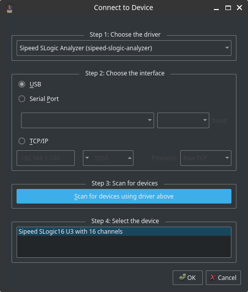

# 常见问题

## 为什么找不到 SLogic16U3 设备？


最常见的原因是 PulseView 在连接 SLogic16U3 之前就已启动。如果软件在启动时找不到设备，它可能不会自动再次探测设备。

解决办法：
1. 要自动检测，请先连接 SLogic16U3，然后再启动 PulseView。软件在启动时应能自动检测到设备。
2. 如果你是在启动软件后才插入设备，请在插入设备后手动打开“连接到设备”（或“设备设置”）对话框：
   - 打开 “Connect to Device”。
   - 选择适用于 SLogic16U3 的驱动/后端。
   - 点击 “Scan” 来发现已连接的设备。
   - 从列表中选择 SLogic 设备并点击 “OK”。
   - UI 会返回到捕获/主页面，设备将可用。
   - 

另外，在 Linux 上普通用户默认无法访问 USB 设备，因为权限受限。 
可选两种方法之一：

- 使用 root 权限运行 PulseView（快速测试）:
```bash
sudo ./Pulseview.appimage
```
- 设置 udev 规则以便普通用户可以访问设备（推荐）。关于 udev 规则和安装步骤，请参见下文“如何为 Linux 设置 udev 规则？”部分。

## 如何为 Linux 设置 udev 规则？

创建一个新的 udev 规则文件：

```bash
sudo tee /etc/udev/rules.d/60-sipeed.rules <<EOF
SUBSYSTEM!="usb|usb_device", GOTO="sipeed_rules_end"
ACTION!="add", GOTO="sipeed_rules_end"
ATTRS{idVendor}=="359f", MODE="0666", GROUP="plug_dev", TAG+="uaccess"
ENV{ID_MM_DEVICE_IGNORE}="1"
LABEL="sipeed_rules_end"
EOF
```

重新加载 udev 规则并触发：

```bash
sudo udevadm control --reload
sudo udevadm trigger
```

拔掉并重新连接设备。
现在你可以以普通用户身份运行 PulseView。

## 为什么无法使用更高的采样率？只显示 200M。

最大采样率取决于活动通道数和 USB 带宽。
SLogic16U3 的 USB 3.0 提供大约 ~400MB/s 的带宽。
要使用更高的采样率（例如 400M/800M），请禁用未使用的通道。


## 装置锁定在DFU模式，无法切换至SLogic模式
这通常意味着SLogic固件损坏，可能是由于OTA失败导致。
  
  解决方法：重新OTA正确的固件。

## 无法切换至DFU模式，提示"unknown usb device"
这意味着USB枚举失败，可能是由于USB线缆过长/质量不好导致。
  
  解决方法：尝试使用更短/质量好的USB线缆重试。
