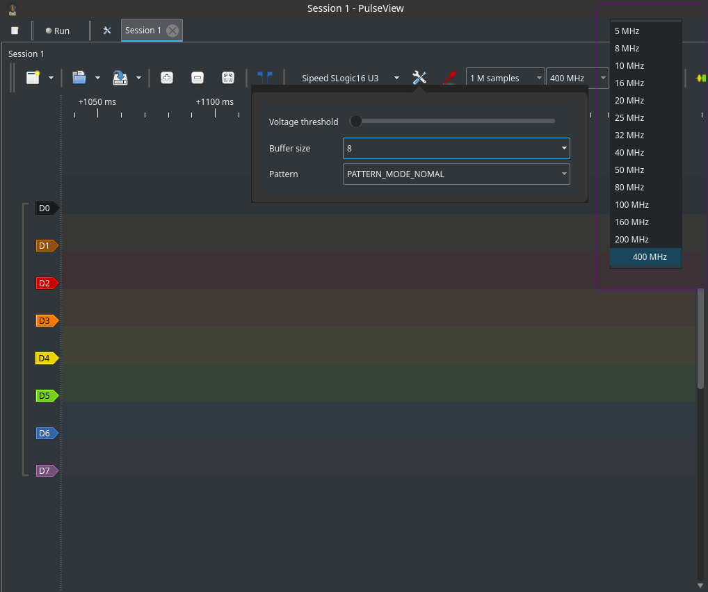
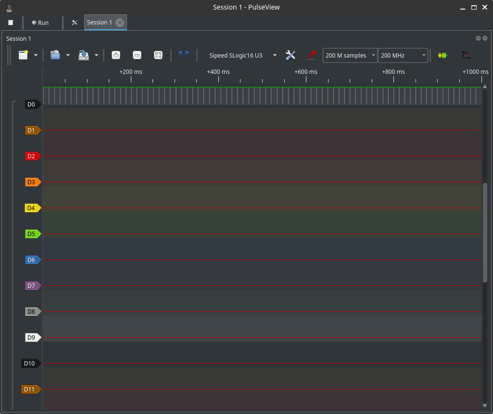
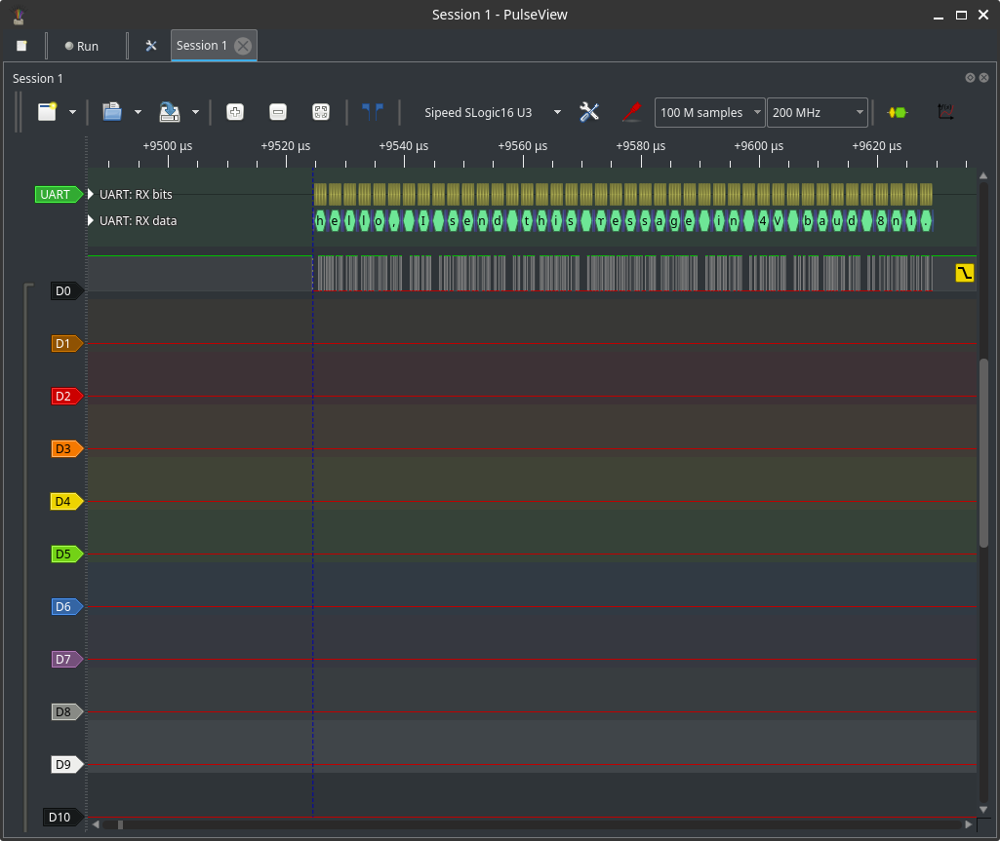
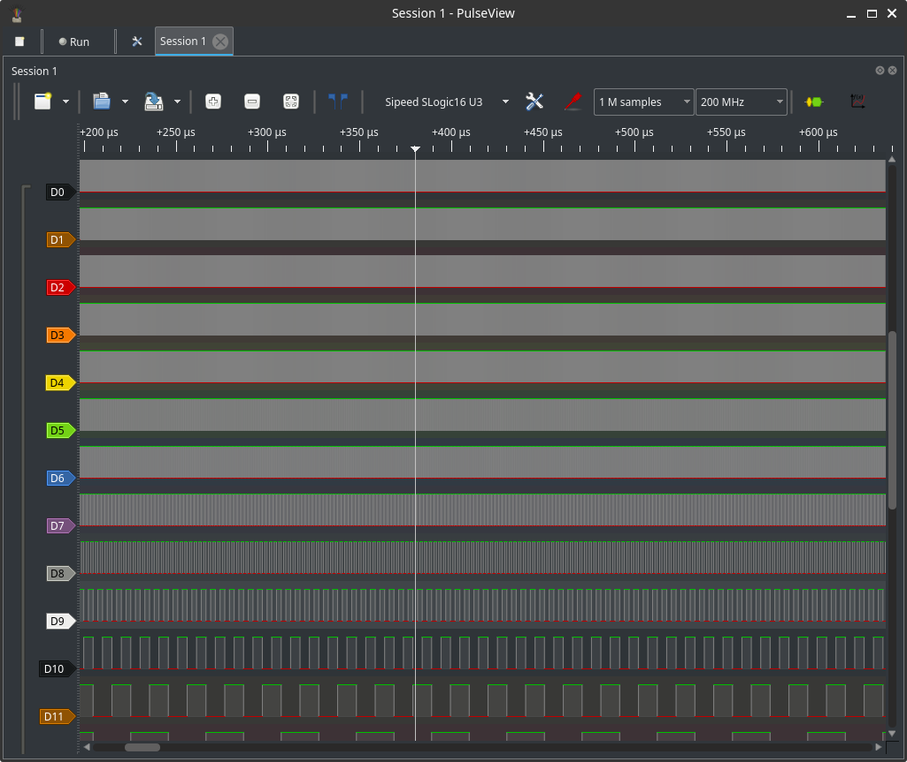
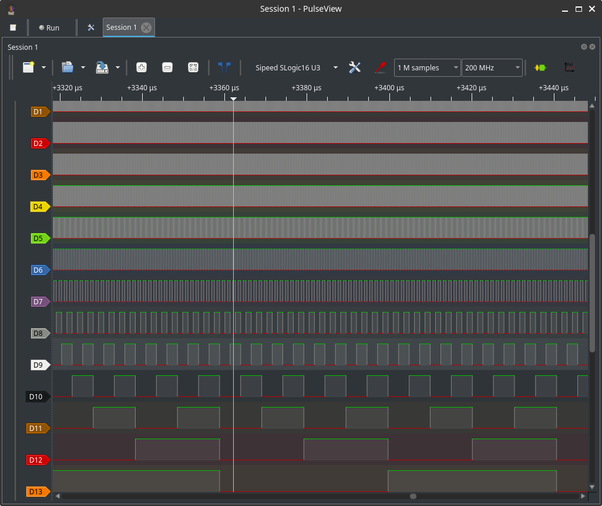
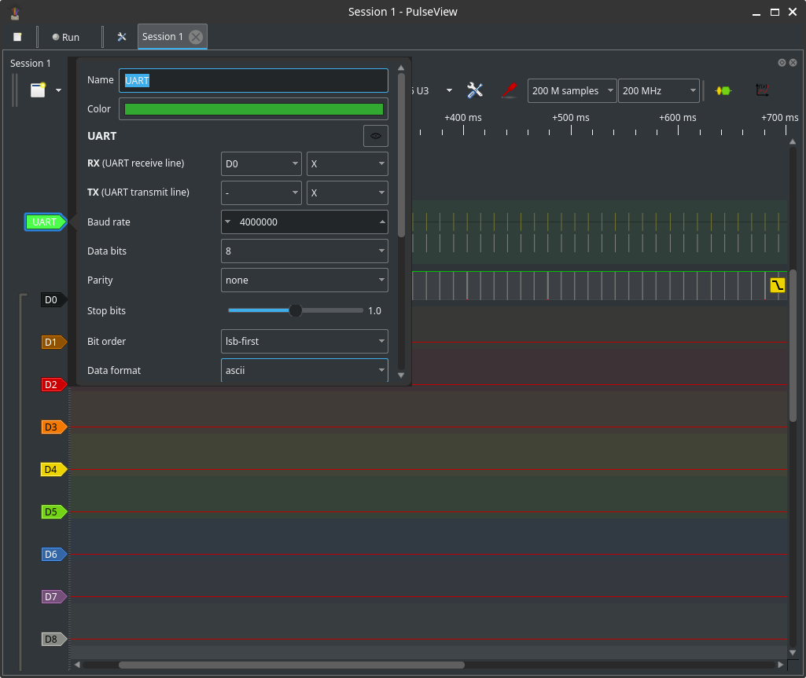
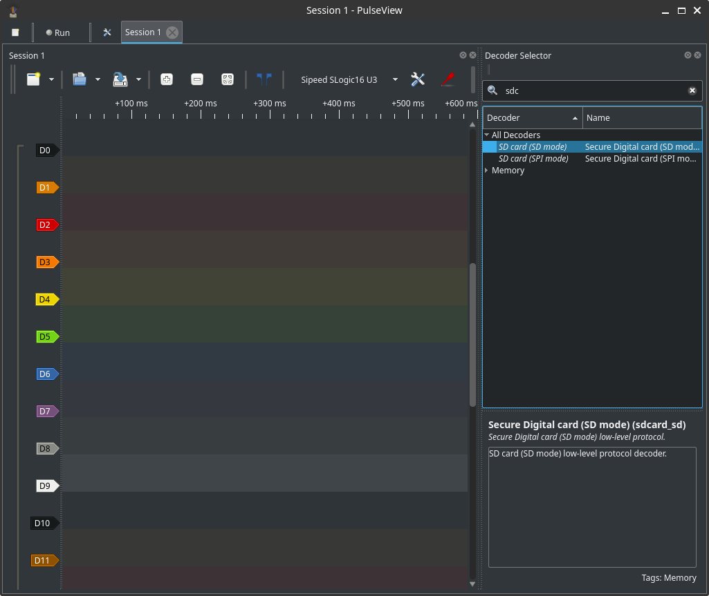
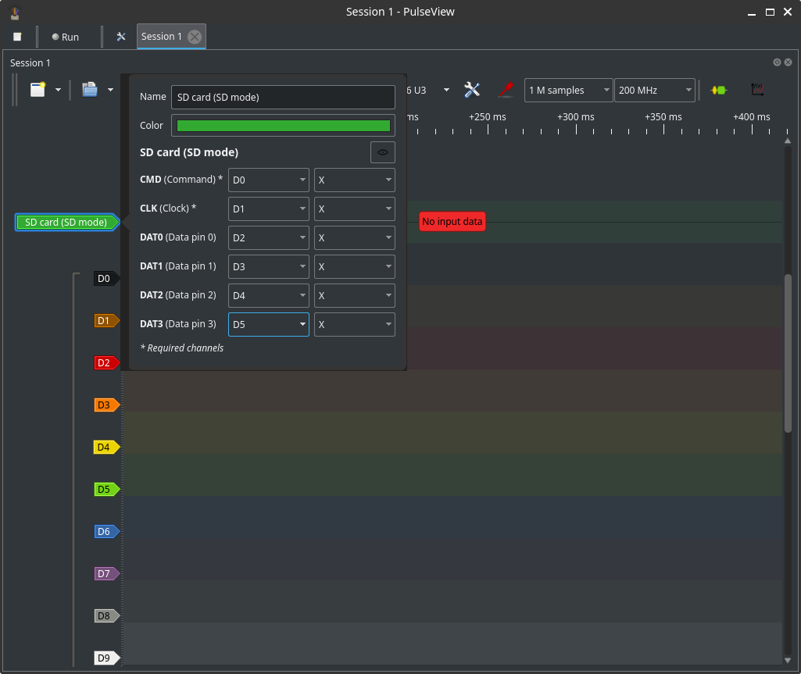
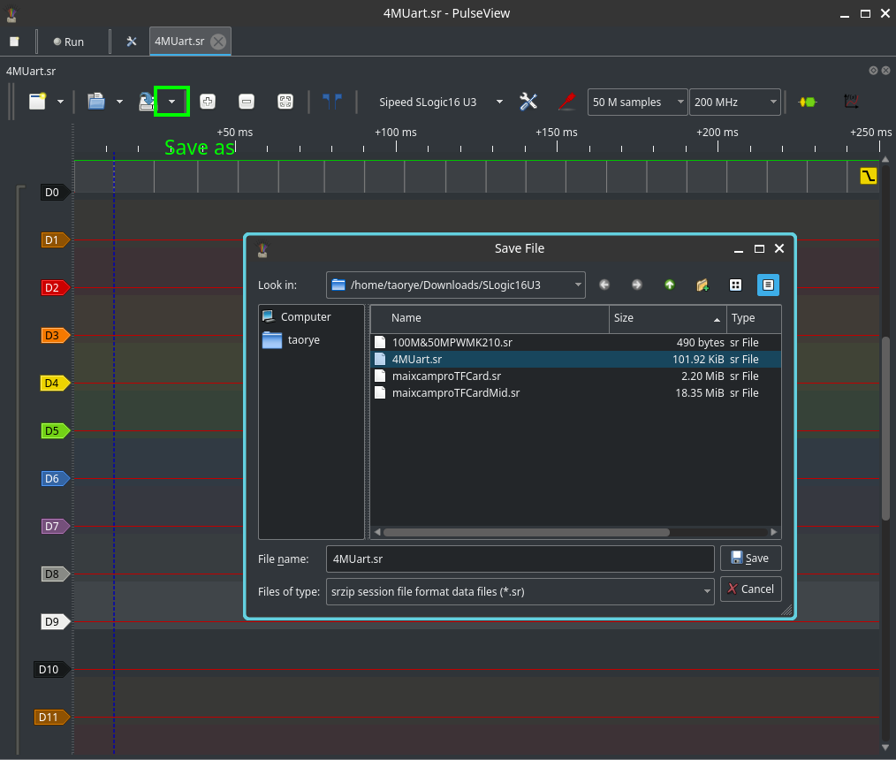

# SLogic16U3 — 软件使用指南

本指南说明如何在捕获应用中使用 SLogic16U3。覆盖设备连接与检测、跨平台的用户界面、基础与高级采样设置、捕获流程、浏览与测量工具、协议解码以及文件操作。

## 连接 SLogic
最佳做法：在主机上将 SLogic16U3 连接到 USB 3.0 接口，然后再启动捕获应用，这样软件可以在启动时自动检测到设备。

如果应用已在运行：
- 将 SLogic 插入 USB 3.0 主机端口（避免使用无电源的集线器）。
- 打开应用菜单，选择 “Connect to Device” 端选择对话框。
- 选择 SLogic 驱动/后端。
- 点击 “Scan” 或 “Refresh”。
- 从发现的设备列表中选择 SLogic 设备，点击 “OK”。

故障排查清单：
- 尝试更换 USB 数据线或使用不同的主机端口。
- 确认设备电源/LED 指示正常。
- 拔插设备后重新打开连接对话框或重启应用。
- 在 Linux 上检查权限（可用 sudo 进行快速测试或安装 udev 规则；参见 FAQ）。
- 参见: [Why can't I find the SLogic16U3 device?](./FAQ.html#why-cant-i-find-the-slogic16u3-device)

## 用户界面

### Windows
- 菜单、对话框和文件对话框遵循 Windows 约定。

### Linux
- 布局与其他平台相似。
- 注意：普通 Linux 用户可能没有访问 USB 设备的权限。快速测试可使用 sudo 运行应用；日常使用请安装 udev 规则（参见 FAQ）。
- 在终端运行 `AppImage -l5` 可以在故障排查时显示有用日志。

### macOS
- 菜单位于系统菜单栏；对话框与 macOS UI 约定集成。
- 如果 macOS 阻止访问，请打开 系统偏好设置 → 安全性与隐私 并为应用授予权限。
- 优先使用主板直连端口或有电源的 USB3 集线器。

## 基本采样模式与配置
在采集之前，配置以下核心设置：

- 通道使能：仅启用所需通道以减少带宽占用并提高采样率余量。
- 电压阈值：根据被测设备（DUT）的逻辑电平设置。
- 采样率：选择预设；允许的采样率取决于启用通道数和 USB 带宽。
- 采样深度 / 捕获长度：选择捕获样点数。

### 配置（混合设置）
推荐的快速工作流程：
1. 启用所需通道（按需 16/8/4）。
2. 在支持时设置电压阈值。
3. 选择与启用通道兼容的采样率预设。
4. 选择采样深度。
5. 配置触发或直接开始采集。

提示：
- 减少启用通道可提高可达采样率。
- 对于长时间捕获，保存/导出前请确认磁盘空间。

### 电压阈值
- 选择与 DUT 匹配的阈值：
  - 例如 ~1.6 V 适用于很多低电压系统（如 3.3 V 或 5 V 逻辑）。
  - 最高可达 6.0 V 用于更高电压信号——先确认硬件限制。
- 不确定时，先用万用表或示波器测量信号再连接。

### 通道 / 采样率预设
- 随着启用通道增多，可用采样率会减少（受 USB 吞吐量限制）。
- 使用预设列表在标准模式间切换（16ch / 8ch / 4ch）。
- 需要更高时间分辨率时，减少活动通道并提高采样率。

### 采样深度 / 捕获长度
- 选择采样深度（点数）或捕获时间。采样率 × 深度决定内存和存储使用。

## 高级：触发配置
通常支持的触发类型包括：
- 单通道的边沿触发（上升/下降）。
- 电平触发（信号在阈值上/下保持一段时间）。
- 跨多个通道的组合触发。

设置基本边沿触发的方法：
1. 打开触发设置。
2. 选择通道并选择 Rising（上升）或 Falling（下降）等。
3. 如需复合触发，可添加额外通道条件。

## 捕获流程

### 典型步骤
1. 连接设备并确认检测到。
2. 配置通道、电压阈值和采样率。
3. 设置采样深度和触发模式。
4. 启动捕获并等待完成。
5. 检查波形并使用解码器或测量工具。

捕获模式：
- 连续/流式：持续捕获直到停止；注意数据大小和内存管理。

如遇样点丢失：
- 降低采样率或减少启用通道。
- 使用专用 USB 3.0 端口并选用高质量 USB 数据线。

### 使用触发时
- 在开始捕获前配置触发条件以确保事件被捕获到缓冲区中。

## 浏览与标尺测量
导航与控制：
- 缩放：鼠标滚轮或上下按钮。
- 前后平移：拖动或按住 Shift + 滚动 或按住 Shift + 上下按钮。
- 垂直平移：按住 Ctrl + 滚动 或按住 Ctrl + 上下按钮。

标尺：
- 添加时间标尺以测量间隔。放置两个标尺可计算时间差。
- 使用标尺测量来计算波特率、脉宽或事件间隔。
- 按住 Shift + 拖动以创建测量标尺。

## 协议解码
要解码总线：
1. 打开 Decoder 窗格。
2. 选择协议（I2C、SPI、UART、CAN、SDIO 等）。
3. 配置引脚、字节序（LSB/MSB）、时钟极性/相位及波特率/时钟速率。
4. 启用解码器；解码后的帧会标注在波形上并可点击查看详情。

提示：
- 正确映射探针引脚到逻辑信号（MOSI/MISO/SCLK/CS、TX/RX）。
- 对于高速总线提高采样率以确保正确解码。
- 禁用未使用的解码器以减少 CPU 与 UI 负载。

### UART 示例（4M）

### SDIO / SDCard 示例

## 文件操作（保存 / 加载）
- 保存会话：存储捕获的样本、通道配置、触发设置和解码器状态。使用会话可保存工作以便以后分析。
- 加载会话：恢复已保存的捕获和 UI 状态。

<!-- End of Software User Guide -->
