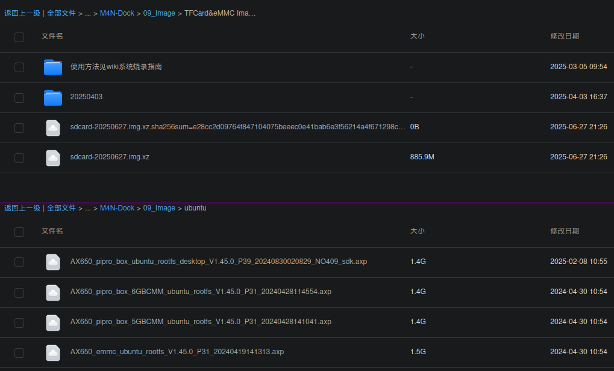

本指南详细介绍了 M4C-Dock 开发板的两种系统烧录方法：通过 TFCard 启动和烧录 eMMC，以及通过 AXDL 工具烧录。请根据您的需求选择合适的方法。


## 镜像文件说明

*该页面介绍的烧录方法所使用的镜像包因体积过大，且下载站带宽有限故仅存储在百度企业网盘同级目录下，入口链接可见于[下载站页面顶端区域](https://dl.sipeed.com/)。*


| 镜像类型           | 启动特点                                    | 文件名        | 获取方法           |
|-------------------|-------------------------------------------|--------------|-------------------|
| TFCard&eMMC Image | `烧录 eMMC 上电自启` 或 `烧录 TFCard 手动启动` | `sdcard.img` | 下载路径：MaixIV/M4N-Dock/09_Image/TFCard&eMMC Images           |
| AXSDK AXP         | `烧录 eMMC 上电自启`                        | `xxx.axp`    | 下载路径：MaixIV/M4N-Dock/09_Image/ubuntu                       |


若下载的镜像文件是 `.xz` 结尾，请先进行解压操作。Linux 用户可使用 xz 工具，Windows 用户可使用 7-zip 等工具。



## 通过 TFCard 启动和烧录 eMMC

### 启动 Live 系统（需手动按键操作）

#### 第一步：准备 TFCard 并烧录镜像

准备一张至少 8GB 的 TFCard，使用任意读卡器工具或电脑自带的卡槽进行读写。

注意：按以下操作，TFCard 内容将会全部丢失，如有重要数据请提前备份。

| 操作系统   | 烧录方法                                                                 |
|------------|--------------------------------------------------------------------------|
| Linux      | `sudo dd if=sdcard.img of=/dev/sdX bs=4M conv=fsync status=progress`    |
| Windows    | 使用 `Win32DiskImager` 或 `Rufus` 或 `balenaEtcher` 进行烧录            |

附 Linux 例子：
```bash
# 使用读卡器挂载了 TFCard 为 /dev/sdb 设备
% sudo dd if=sdcard.img of=/dev/sdb bs=4G conv=sparse,fsync status=progress 
0+3 records in
0+3 records out
5754429440 bytes (5.8 GB, 5.4 GiB) copied, 89.2665 s, 64.5 MB/s
```

#### 第二步：使用烧录有镜像的 TFCard 启动 Live 系统

**TFCard 启动方法**

| 底板       | 设备树                | TF 卡槽位置                     |  `BOOT` 按键位置            |
|------------|---------------------|--------------------------------|---------------------------|
| Dock       | `dtbs/m4nbox.dtb`     | 尾部左上方，Type-C 座子的对角线位置 |  Type-C 座子旁边 BOOT 丝印处 |
| Hat        | `dtbs/m4nhat.dtb`     | USB3 母座和缺口之间，位于背面      |  HDMI 座子旁边 BOOT0 丝印处  |
| Cluster    | `dtbs/m4ncluster.dtb` | M.2 座子下方                    |  Type-C 座子旁边 BOOT 丝印处 |

1. 挂载 TFCard 并修改 FAT32 分区 config.txt 文件中 `dtb_img_name=dtbs/m4nbox.dtb` 为对应底板的值。

2. 将 TFCard 插入 TF 卡槽内。

3. 按住 `BOOT` 按键不放，复位：1.重新上电 或 2.保持上电点按（按下再松开） `RST` 按键。

    3.1. 如有外壳遮蔽（如 M4C-Dock），需要移除前面板，可拧下 3 颗螺丝然后旋转打开。

执行完以上操作， Live 系统应已启动，可通过串口0看到系统启动的打印信息。

**该 Live 系统功能完全，可直接上手体验使用。如需要上电自启进入系统而不需要额外的按键操作的话，请固化镜像到 eMMC，具体操作烦请续看下节。**


### 在 Live 系统内烧录 eMMC（上电自动启动）

板载 eMMC 的设备名将保持为 `/dev/mmcblk0`，相对的 TFCard 的设备名则为 `/dev/mmcblk1`，请注意区分。

现提供两个方法，都可以完成烧录镜像到板载 eMMC 的操作。可自行选择：

#### 方法一：直接安装 Live 系统

1. 按上节说明成功进入 Live 系统，接着打开终端执行后续操作。

2. 使用 `dd` 将 TFCard 内的 Live 系统直接还原到 eMMC 中，具体命令如下：

    ```sh
    dd if=/dev/mmcblk1 of=/dev/mmcblk0 bs=3M count=1 conv=fsync
    sync # 确保分区表生效
    dd if=/dev/mmcblk1p1 of=/dev/mmcblk0p1 bs=64M conv=fsync
    dd if=/dev/mmcblk1p2 of=/dev/mmcblk0p2 bs=1G conv=sparse,fsync status=progress
    fsck -y /dev/mmcblk0p2
    sync
    ```

3. 等待上述指令执行完后，即可取出 TFCard。后续可直接上电或点按 `RST`，之后应能正常启动进入 eMMC 系统。

#### 方法二：Live 系统内烧录镜像

要求：能够访问和读写已烧录 Live 系统的 TFCard 格式为 `ext4` 的第二分区，如不清楚相关知识点，那么该方法暂时不适用，请采用更通用的方法一。

1. 拷贝镜像文件 `sdcard.img` 到第二分区（Live系统根目录）任意地方。

2. 参考 TFCard 烧录 Live 系统镜像，执行以下命令：

    ```sh
    dd if=/path/to/sdcard.img of=/dev/mmcblk0 bs=1G conv=sparse,fsync status=progress
    ```

3. 等待上述指令执行完后，即可取出 TFCard，后续可直接上电或点按 `RST` 正常启动 eMMC 内系统。


## 通过 AXDL 烧录

烧录文件名格式为 `xxx.axp`。

具体操作方法见首页资源汇总软件开发文档压缩包内`AXDL 工具使用指南.pdf`。

**提示：官方 EVB 板上 Download 按键对应各底板的 BOOT 按键操作**

AXDL软件（仅 Windows 可用）位于下载站`PC_Software`目录下。

**注意：M4N-Dock 的 USB 烧录口是位于靠近 `HDMI` 接口的以太网座子最下面贴近板子的那一个 `USB-A` 口。请准备`A-to-A`的数据线，或者电脑有 `Type-C` 口也可以直接使用 `A-to-C` 的数据线。其余底板都是 Type-C**

**注意：烧写时不要连接 `12V` 电源，仅使用 USB 烧写线供电即可，否则有烧毁 `PC` 的 `USB接口` 的风险**
