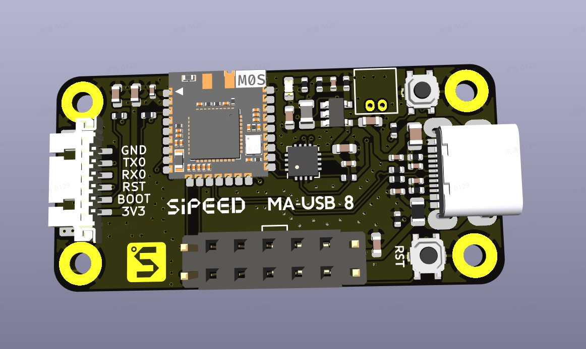
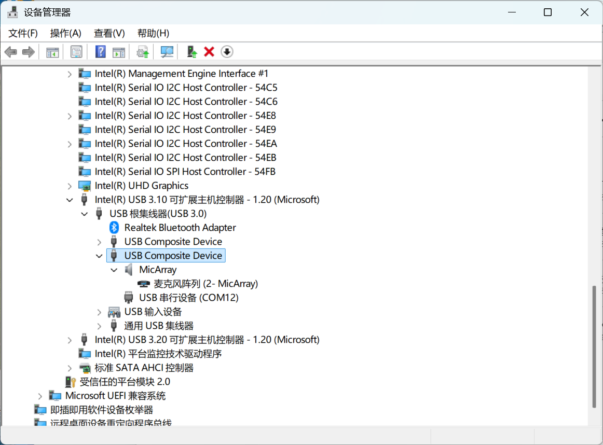
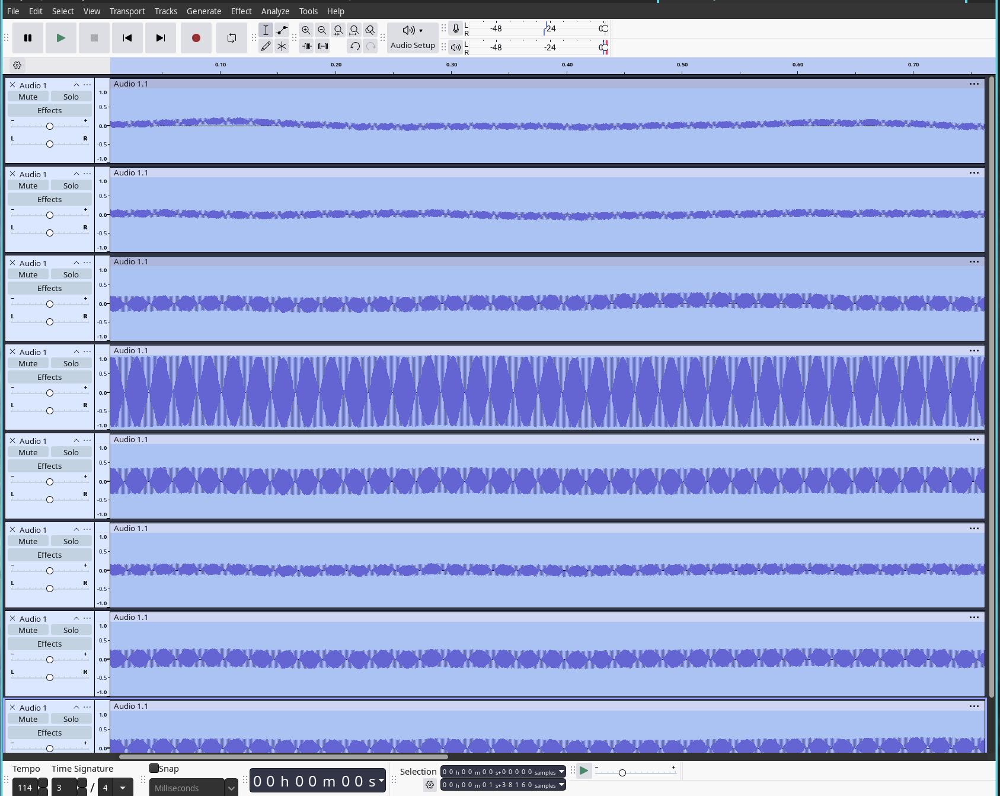
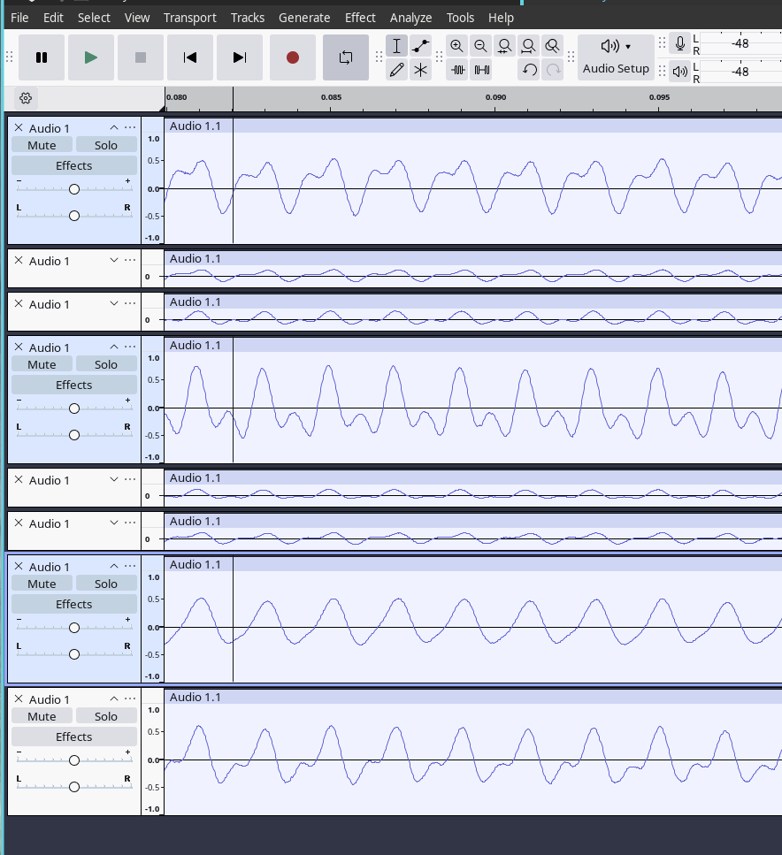
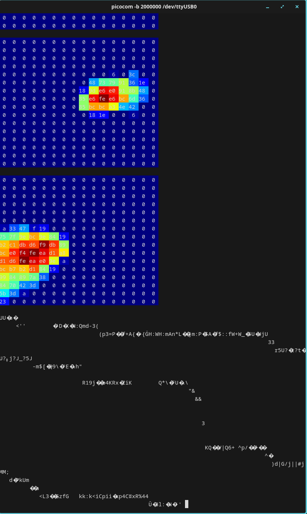

# 麦克风阵列UAC驱动板 MA-USB8

## 产品介绍

搭配麦克风阵列模块使用,提供 UAC2.0 + CDC ACM + UART 接口.

- UAC2.0: 8CH S16_LE 48000HZ
- CDC ACM: 16x16 Hotmap Frame
- UART: 16x16 Hotmap Frame on baudrate:2000000 

### Hotmap Frame Format:

| frame| bytes        | value    |
|------|--------------|----------|
| head | 16           | 16x 0xFF |
| data | 16x16 (HxW)  | ...      |

## 硬件连接

以下连接方式选择其一即可:
- 首选 USB <---> UAC2.0 + CDC ACM (全量功能: 获取音频数据,同时获取声场图)
- 或 UART/USB2TTL <---> UART (有限性能场景如MCU: 仅获取声场图)

### Linux

### Windows

## 使用体验

### USB UAC2.0 (Audacity)

**Windows WASAPI**

  
  

### USB UAC2.0 Beamforming (Audacity)

驱动板支持12方向的波束成型，即抑制用户设置的监听方向之外的音频，达到给目标监听方向增益降噪的效果。以下以正弦波音频实例测试讲解:

Mic0(CH0) 接近 500HZ 正弦波，Mic3(CH3) 接近 1000HZ 正弦波。

串口输入 `0`，这样 CH6 就是 CH0 处波束成形的输出。

显然在 CH6 上，增益了靠近 CH0 处的 500hz 正弦波信号并消除了其他角度的 1000hz 正弦波信号带来的影响。

### USB CDC ACM RAW (Minicom) and USB2TTL UART HEX-CMAP (Picocom)

### USB CDC ACM RAW (Minicom)

`minicom -D /dev/ttyACM0 -H`

### USB2TTL UART RAW (Minicom)

`minicom -D /dev/ttyUSB0 -b 2000000 -H`

### USB2TTL UART RAW,HEX-CMAP (Picocom)

1. `picocom -b 2000000 /dev/ttyUSB0`

2. 输入 `F` 然后再输入 `C`

  
  

3. 输入 `f`

## 指令详解

| 指令                          | 输入(小/大写: 关/开) | 默认值 | 备注                                         |   输入源        |
|------------------------------|--------------------|-------|---------------------------------------------|----------------|
| 设置 UAC CH6 波束成型方向角度    | 0,1,..9,A,B        | 0     | 实际角度为输入值x30 (0,1,..B => 0,30,..,330)对应 0 号麦克风起始沿标号递增方向,搭配[麦克风阵列](./micarray.md)即为沿顺时针方向    | 任意            |
| UART 声源定位图底色 伪彩映射 开关 | c, C               | c     | 需要前置条件:UART 打印 16x16 声源定位图 开       | 仅 UART 输入有效 |
| UART 打印内部调试信息 开关       | d, D               | d     | 控制内部调试                                  | 仅 UART 输入有效 |
| LED 声源方向实时指示 开关        | e, E               | E     | 控制LED灯                                    | 任意            |
| UART 16x16 声源定位图 打印开关   | f, F               | f     | 切换打印 16x16 声源定位图(ascii)               | 仅 UART 输入有效 |
| 恢复默认值                      | R                  | \     |恢复一系列配置默认值                            | 任意            |

## 更新固件

下载 [固件](../../assets/modules/micarray_usbboard_bl616/firmware/MA-USB8-250822.bin) 然后参考 [这篇教程](../logic_analyzer/combo8/update_firmware.html#Burn-firmware) 更新板载固件.